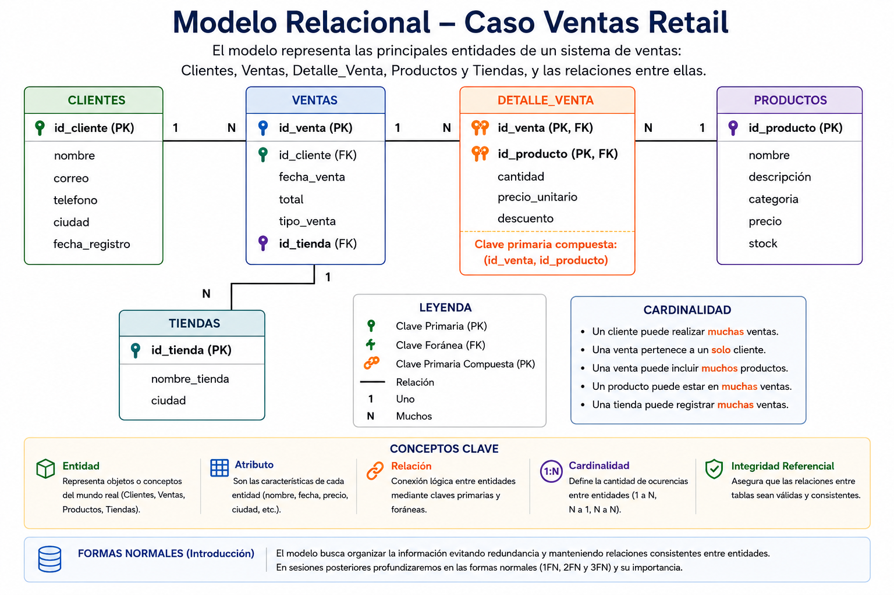

# Sesión 1
# Fundamentos de Ingeniería de Datos y Modelamiento Relacional

**Duración:** 4 horas  
**Modalidad:** Online sincrónica  
**Entorno práctico:** Oracle APEX (cloud)  
**RAA dominante:** RAA1  

---

# Descripción de la jornada

La presente sesión tiene como propósito introducir los fundamentos de la ingeniería de datos y el modelamiento relacional, abordando conceptos esenciales para la estructuración y organización de información en contextos organizacionales. Durante la jornada, los estudiantes trabajarán en un entorno cloud utilizando Oracle APEX, construyendo progresivamente un modelo relacional académico mediante tablas, relaciones y claves primarias/foráneas.

---

# Resultados de Aprendizaje de la Jornada

Al finalizar la sesión, el estudiante será capaz de:

- Reconocer el rol de la ingeniería de datos en entornos organizacionales.
- Identificar entidades, atributos y relaciones en un escenario práctico.
- Comprender la función de las claves primarias y foráneas.
- Construir tablas relacionales básicas utilizando SQL.
- Implementar un modelo relacional inicial en Oracle APEX.

---

# Agenda de la Jornada

| Bloque   | Duración | Actividad                                          |
| -------- | -------- | -------------------------------------------------- |
| Bloque 1 | 60 min   | Introducción conceptual y demostración práctica    |
| Break    | 15 min   | Descanso                                           |
| Bloque 2 | 45 min   | Desarrollo del ejercicio aplicado                  |
| Bloque 3 | 45 min   | Revisión y exposición de soluciones                |
| Break    | 10 min   | Descanso                                           |
| Bloque 4 | 45 min   | Retroalimentación, preguntas y revisión de avances |

---

# Contenidos Principales

## 1. Introducción a la Ingeniería de Datos

- ¿Qué es la ingeniería de datos?
- Rol de los datos en organizaciones modernas.
- Diferencias entre:
  - Bases de datos
  - Business Intelligence
  - Analítica de datos
  - Ingeniería de datos
- Ecosistemas modernos de datos.
### 1.1 ¿Qué es la Ingeniería de Datos?

La ingeniería de datos corresponde al conjunto de procesos, herramientas y tecnologías utilizadas para capturar, almacenar, transformar y disponibilizar datos de manera eficiente para distintos tipos de análisis y procesos organizacionales.

En términos prácticos, la ingeniería de datos permite que los datos puedan ser utilizados posteriormente por:
- sistemas transaccionales;
- plataformas analíticas;
- procesos ETL;
- modelos de machine learning;
- dashboards;
- y herramientas de Business Intelligence.

### 1.2 Rol de los Datos en las Organizaciones

Actualmente, las organizaciones generan grandes volúmenes de información provenientes de distintas fuentes:

- ventas;
- clientes;
- sensores;
- plataformas web;
- redes sociales;
- sistemas académicos;
- dispositivos móviles.

La ingeniería de datos permite estructurar y organizar esta información para transformarla en un recurso útil para la toma de decisiones.

### 1.3 Diferencias entre Conceptos Relacionados

| Concepto              | Propósito principal                       |
| --------------------- | ----------------------------------------- |
| Base de datos         | Almacenar información                     |
| SQL                   | Consultar y manipular datos               |
| Business Intelligence | Analizar información                      |
| Analítica de datos    | Encontrar patrones                        |
| Ingeniería de datos   | Construir y mantener ecosistemas de datos |

### 1.4 Ecosistema Moderno de Datos

Un flujo simplificado de datos podría representarse de la siguiente forma:
$Datos → Base de Datos → SQL → ETL → Data Warehouse → BI → Machine Learning$

## 2. Fundamentos del Modelamiento Relacional

- Entidades.
- Atributos.
- Relaciones.
- Cardinalidad.
- Integridad referencial.
- Claves primarias (PK).
- Claves foráneas (FK).

### Modelo Entidad Relación (MER)

El modelamiento relacional corresponde a una forma de estructurar y organizar información mediante tablas relacionadas entre sí. Cada tabla representa una entidad del mundo real, por ejemplo clientes, productos o ventas, mientras que sus columnas describen atributos asociados a dichas entidades, como nombres, fechas o precios. Este enfoque permite almacenar información de manera organizada, evitando duplicidad de datos y facilitando posteriormente su consulta y análisis mediante SQL.

Las relaciones entre tablas se establecen utilizando claves primarias (PK) y claves foráneas (FK). Una clave primaria permite identificar de forma única cada registro dentro de una tabla, mientras que una clave foránea conecta información entre distintas entidades. A través de estas relaciones es posible mantener integridad referencial y representar escenarios organizacionales reales, como clientes que realizan ventas o productos asociados a múltiples transacciones.

### Caso Práctico: Sistema de Ventas Retail

Una empresa de ventas retail necesita organizar la información asociada a sus clientes, productos y transacciones comerciales. Actualmente, la organización registra diariamente cientos de ventas realizadas tanto en tiendas físicas como mediante plataformas digitales, lo que genera grandes volúmenes de información que posteriormente deben ser analizados para apoyar la toma de decisiones.

Para resolver este problema, la empresa requiere construir una base de datos que permita almacenar de manera estructurada la información de clientes, productos y ventas. Cada cliente puede realizar múltiples compras, mientras que cada venta puede incluir varios productos distintos. A su vez, los productos pueden participar en muchas transacciones diferentes. Este tipo de escenario representa un contexto típico donde el modelamiento relacional permite organizar datos, establecer relaciones entre entidades y mantener consistencia en la información almacenada.

A partir de este caso, se analizarán conceptos fundamentales del modelamiento relacional, incluyendo:

## Actividad práctica — Diseño de un Modelo Entidad–Relación (MER)

**Contexto del caso**

Una universidad desea construir un sistema académico que permita administrar información relacionada con:
- estudiantes;
- carreras;
- docentes;
- asignaturas;
- matrículas;
- evaluaciones académicas.

Actualmente la información se encuentra dispersa y sin una estructura clara, lo que dificulta el seguimiento académico de los estudiantes y la generación de reportes institucionales.

Por esta razón, el equipo de ingeniería de datos ha sido encargado de diseñar un modelo relacional que permita organizar la información de manera eficiente y consistente.

**Objetivo de la actividad**

Diseñar un Modelo Entidad–Relación (MER) que represente correctamente las principales entidades del sistema académico y las relaciones existentes entre ellas.

El modelo debe permitir posteriormente:
- implementar tablas en una base de datos;
- realizar consultas SQL;
- analizar información académica;
- mantener integridad y consistencia de los datos.

**Elementos que deben identificarse**

Durante el desarrollo del modelo, cada grupo deberá identificar:

1. **Entidades**

Objetos principales del sistema.

Ejemplos:
  - estudiantes;
  - carreras;
  - docentes;
  - asignaturas.

2. **Atributos**

Características o propiedades de cada entidad.

Ejemplos:
  - nombre;
  - rut;
  - semestre;
  - nota;
  - créditos.

3. **Relaciones**

Conexiones lógicas entre entidades.

Ejemplos:
  - un estudiante se matricula en asignaturas;
  - un docente dicta asignaturas.

4. **Cardinalidad**

Cantidad de ocurrencias permitidas entre entidades.

Ejemplos:
  - una carrera tiene muchos estudiantes;
  - una asignatura puede tener muchas matrículas.

5. **Claves primarias (PK)**

Atributos que identifican de manera única cada registro.

Ejemplo:
  - id_estudiante;
  - id_asignatura.

5. **Claves foráneas (FK)**

Atributos que permiten relacionar tablas entre sí.

Ejemplo:
  - id_carrera dentro de ESTUDIANTES;
  - id_docente dentro de ASIGNATURAS.

**Tiempo disponible**
45 minutos.

**Entregable esperado**
- diagrama MER;
- explicación breve de las relaciones principales;
- identificación de PK y FK.
