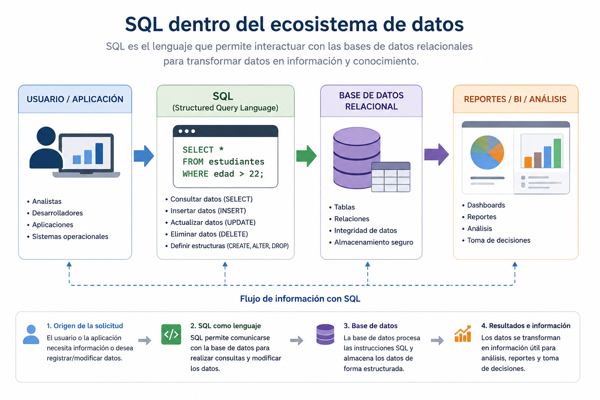
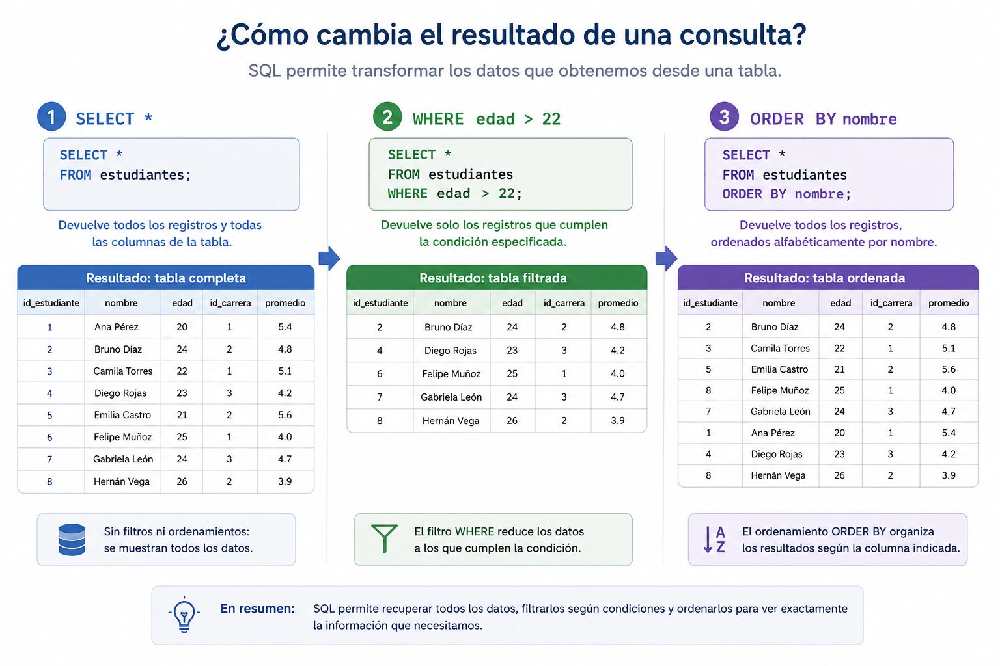
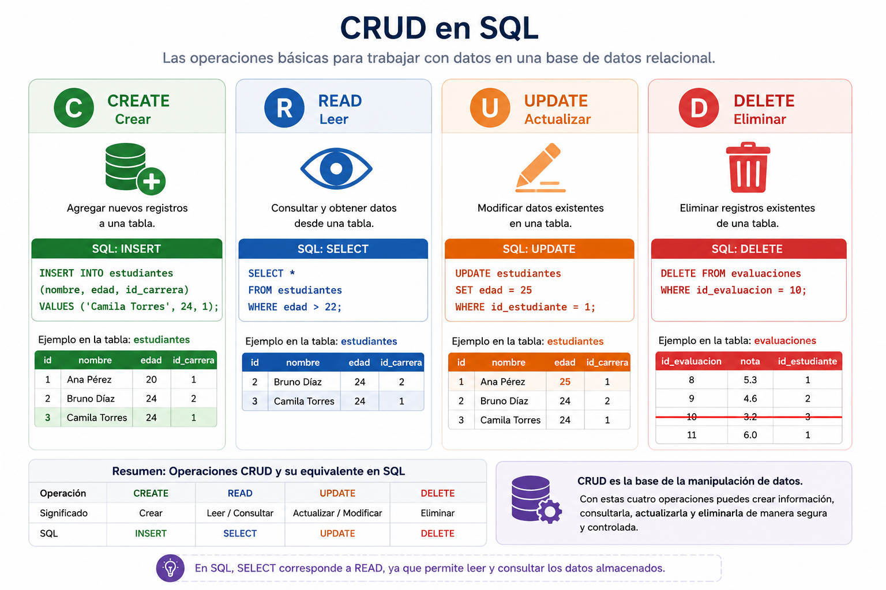
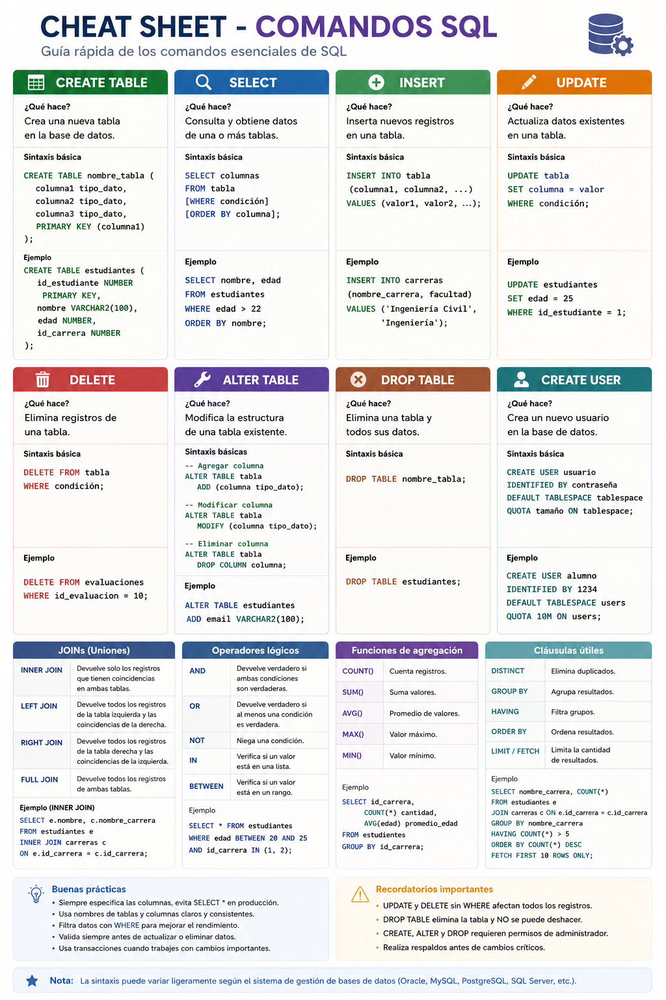

# Sesión 2

# Fundamentos de Ingeniería de Datos y Modelamiento Relacional

**Duración:** 4 horas  
**Modalidad:** Online sincrónica  
**Entorno práctico:** Oracle APEX (cloud)  
**RAA dominante:** RAA2  

# Descripción de la jornada

La presente sesión tiene como propósito comprender y aplicar operaciones básicas de manipulación y consulta de datos utilizando SQL sobre un modelo relacional previamente construido.

---
Resultados de Aprendizaje de la Jornada

Al finalizar la sesión, el estudiante será capaz de:

- Ejecutar consultas básicas utilizando SELECT.
- Filtrar registros mediante WHERE.
- Ordenar resultados utilizando ORDER BY.
- Insertar, actualizar y eliminar registros mediante SQL.
- Aplicar operaciones CRUD sobre un modelo relacional académico.

---

# Agenda de la Jornada

| Bloque               | Tiempo | Actividad                                       |
| -------------------- | ------ | ----------------------------------------------- |
| Exposición guiada    | 60 min | SELECT, WHERE, ORDER BY, INSERT, UPDATE, DELETE |
| Descanso             | 15 min | Break                                           |
| Taller práctico      | 45 min | Manipulación de datos sobre el modelo académico |
| Revisión guiada      | 45 min | Solución paso a paso                            |
| Break                | 10 min | Pausa                                           |
| Preguntas y revisión | 45 min | Dudas + consultas individuales                  |

---

# Contenidos principales

## 1. ¿Qué es SQL?

SQL (*Structured Query Language*) es el lenguaje estándar utilizado para interactuar con bases de datos relacionales. Su propósito principal es permitir la creación, consulta, modificación y administración de información almacenada en tablas relacionadas entre sí.

Actualmente, SQL es utilizado en múltiples plataformas y motores de bases de datos, tales como Oracle, SQL Server, PostgreSQL, MySQL y SQLite, convirtiéndose en una de las tecnologías fundamentales dentro del análisis de datos, inteligencia de negocios e ingeniería de datos.

En términos simples, SQL permite trabajar con datos de manera estructurada mediante instrucciones que facilitan:
- consultar información;
- insertar registros;
- modificar datos existentes;
- eliminar información;
- crear estructuras de almacenamiento.

---

### 1.1 Principales categorías de instrucciones SQL

Aunque SQL posee muchas funcionalidades, en este taller trabajaremos principalmente con tres grandes grupos de instrucciones:

| Categoría | Propósito | Ejemplos |
|---|---|---|
| Definición de datos | Crear y modificar estructuras | CREATE, ALTER, DROP |
| Manipulación de datos | Insertar y actualizar información | INSERT, UPDATE, DELETE |
| Consulta de datos | Obtener información desde tablas | SELECT, WHERE, ORDER BY |

---

### 1.2 SQL dentro del flujo de trabajo de datos

En contextos organizacionales, SQL suele utilizarse para:
- administrar sistemas transaccionales;
- consultar información operacional;
- alimentar dashboards;
- construir procesos ETL;
- preparar información para análisis y visualización.

Por esta razón, SQL continúa siendo una de las competencias más relevantes dentro del ecosistema moderno de datos.



---


## 2. SELECT

La instrucción `SELECT` es una de las operaciones más utilizadas en SQL, ya que permite consultar información almacenada en una o más tablas. A través de esta instrucción es posible recuperar datos específicos según las necesidades del usuario o del sistema.

En términos simples, `SELECT` funciona como una pregunta realizada a la base de datos. Por ejemplo:
- ¿Qué estudiantes existen?
- ¿Qué asignaturas tienen más créditos?
- ¿Qué evaluaciones poseen notas inferiores a 4.0?

La forma más básica de utilizar `SELECT` consiste en indicar qué columnas se desean visualizar y desde qué tabla se obtendrá la información.

---

### 2.1 Consultar todas las columnas

Cuando se desea visualizar todos los atributos de una tabla, se utiliza el símbolo `*`.

```sql
SELECT * 
FROM estudiantes;
````

En este caso:

* `SELECT` indica que se realizará una consulta;
* `*` representa “todas las columnas”;
* `FROM estudiantes` indica la tabla origen de los datos.

---

### 2.2 Consultar columnas específicas

También es posible recuperar únicamente ciertas columnas de interés.

```sql
SELECT nombre, edad
FROM estudiantes;
```

Esto permite reducir la cantidad de información mostrada y concentrarse únicamente en los datos relevantes para el análisis.

---

### 2.3 Ejemplo sobre el modelo académico

```sql
SELECT nombre_asignatura, creditos
FROM asignaturas;
```

La consulta anterior muestra:

* el nombre de cada asignatura;
* la cantidad de créditos asociados.

---

### 2.4 Buenas prácticas iniciales

Aunque `SELECT *` es útil para exploración inicial, en escenarios reales suele recomendarse seleccionar únicamente las columnas necesarias, ya que:

* mejora la claridad de las consultas;
* reduce el volumen de datos transferidos;
* facilita el análisis y mantenimiento del código SQL.

---

## 3. WHERE

La cláusula `WHERE` permite filtrar registros dentro de una consulta SQL. Gracias a esta instrucción es posible recuperar únicamente la información que cumple una determinada condición.

En otras palabras, `WHERE` funciona como un filtro aplicado sobre los datos almacenados en la tabla.

Por ejemplo:
- estudiantes mayores de cierta edad;
- asignaturas con más de 5 créditos;
- evaluaciones con nota insuficiente;
- matrículas correspondientes a un semestre específico.

---

### 3.1 Ejemplo básico

```sql
SELECT * 
FROM estudiantes
WHERE edad > 22;
````

La consulta anterior:

* recupera todos los atributos de la tabla `estudiantes`;
* pero únicamente muestra aquellos registros donde la edad es mayor a 22 años.

---

### 3.2 Filtrado por texto

También es posible filtrar utilizando valores de tipo texto.

```sql id="f1mx8c"
SELECT *
FROM carreras
WHERE facultad = 'Facultad de Ingeniería y Negocios';
```

En este caso, SQL mostrará únicamente las carreras pertenecientes a esa facultad.

---

### 3.3 Uso de operadores relacionales

La cláusula `WHERE` suele trabajar con distintos operadores:

| Operador | Significado   |
| -------- | ------------- |
| `=`      | Igual         |
| `>`      | Mayor que     |
| `<`      | Menor que     |
| `>=`     | Mayor o igual |
| `<=`     | Menor o igual |
| `<>`     | Distinto      |

---

### 3.4 Ejemplo aplicado al modelo académico

```sql id="m3vtx2"
SELECT nombre_asignatura, creditos
FROM asignaturas
WHERE creditos >= 5;
```

Esta consulta muestra únicamente las asignaturas que poseen 5 o más créditos.

---

### 3.5 Importancia del filtrado

En bases de datos reales pueden existir miles o millones de registros. Por esta razón, utilizar `WHERE` correctamente resulta fundamental para:

* reducir información innecesaria;
* acelerar consultas;
* obtener resultados más precisos;
* apoyar procesos de análisis y toma de decisiones.

---

## 4. ORDER BY

La cláusula `ORDER BY` permite ordenar los resultados obtenidos mediante una consulta SQL. Este ordenamiento puede realizarse de manera ascendente o descendente sobre una o más columnas.

El uso de `ORDER BY` resulta especialmente útil cuando se trabaja con grandes volúmenes de información y se requiere visualizar los datos de manera organizada.

Por ejemplo:
- ordenar estudiantes alfabéticamente;
- visualizar asignaturas según cantidad de créditos;
- mostrar evaluaciones desde la nota más alta a la más baja.

---

### 4.1 Ejemplo básico

```sql
SELECT *
FROM estudiantes
ORDER BY nombre;
````

La consulta anterior:

* recupera todos los registros de la tabla `estudiantes`;
* y los ordena alfabéticamente según la columna `nombre`.

Por defecto, `ORDER BY` utiliza un orden ascendente (`ASC`).

---

### 4.2 Orden ascendente explícito

```sql id="m5e0uc"
SELECT *
FROM estudiantes
ORDER BY edad ASC;
```

En este caso:

* los estudiantes serán mostrados desde la menor edad hacia la mayor.

---

### 4.3 Orden descendente

También es posible ordenar de manera descendente utilizando `DESC`.

```sql id="b8kpj1"
SELECT *
FROM evaluaciones
ORDER BY nota DESC;
```

La consulta anterior mostrará primero las evaluaciones con las notas más altas.

---

### 4.4 Ordenamiento por múltiples columnas

SQL también permite ordenar utilizando más de un criterio.

```sql id="q9j0az"
SELECT *
FROM estudiantes
ORDER BY id_carrera, nombre;
```

En este caso:

* primero se ordena por carrera;
* y luego, dentro de cada carrera, por nombre.

---

### 4.5 Importancia del ordenamiento

El ordenamiento de datos facilita:

* la exploración de información;
* el análisis visual;
* la construcción de reportes;
* y la interpretación de resultados en contextos organizacionales.



---

## 5. INSERT

La instrucción `INSERT` permite agregar nuevos registros dentro de una tabla. Esta operación corresponde a una de las acciones fundamentales de manipulación de datos en SQL, ya que posibilita incorporar nueva información al sistema.

En contextos organizacionales, `INSERT` suele utilizarse para:
- registrar nuevos estudiantes;
- agregar asignaturas;
- almacenar ventas;
- incorporar clientes;
- registrar evaluaciones o transacciones.

---

### 5.1 Estructura básica

```sql
INSERT INTO nombre_tabla (columna1, columna2)
VALUES (valor1, valor2);
````

En esta estructura:

* `INSERT INTO` indica la tabla donde se insertará la información;
* entre paréntesis se especifican las columnas;
* `VALUES` contiene los datos que serán almacenados.

---

### 5.2 Ejemplo básico

```sql
INSERT INTO carreras (nombre_carrera, facultad)
VALUES ('Ingeniería Civil', 'Ingeniería');
```

La consulta anterior:

* agrega un nuevo registro a la tabla `carreras`;
* incorporando el nombre de la carrera y su facultad asociada.

---

### 5.3 Ejemplo sobre estudiantes

```sql id="q5z0am"
INSERT INTO estudiantes (rut, nombre, edad, id_carrera)
VALUES ('21.111.111-1', 'Camila Torres', 24, 1);
```

En este caso:

* se registra un nuevo estudiante;
* indicando su rut, nombre, edad y carrera.

---

### 5.4 Importancia de las claves foráneas

Cuando una tabla posee claves foráneas (`FK`), los valores insertados deben existir previamente en la tabla relacionada.

Por ejemplo:

* `id_carrera = 1`
  solo será válido si dicha carrera ya existe en la tabla `carreras`.

Esto permite mantener integridad referencial y consistencia en los datos almacenados.

---

### 5.5 Buenas prácticas iniciales

Al utilizar `INSERT` se recomienda:

* especificar explícitamente las columnas;
* respetar tipos de datos;
* verificar relaciones entre tablas;
* evitar duplicidad innecesaria de información.

Estas prácticas facilitan el mantenimiento y calidad de las bases de datos relacionales.

---

## 6. UPDATE

La instrucción `UPDATE` permite modificar información existente dentro de una tabla. Esta operación resulta fundamental cuando los datos almacenados necesitan ser corregidos, actualizados o ajustados según nuevos requerimientos del sistema.

En escenarios reales, `UPDATE` suele utilizarse para:
- corregir datos ingresados incorrectamente;
- actualizar estados académicos;
- modificar precios;
- cambiar direcciones o información de clientes;
- actualizar resultados de evaluaciones.

---

### 6.1 Estructura básica

```sql
UPDATE nombre_tabla
SET columna = nuevo_valor
WHERE condicion;
````

En esta estructura:

* `UPDATE` indica la tabla que será modificada;
* `SET` especifica los nuevos valores;
* `WHERE` define qué registros serán actualizados.

---

### 6.2 Ejemplo básico

```sql
UPDATE estudiantes
SET edad = 25
WHERE id_estudiante = 1;
```

La consulta anterior:

* modifica la edad del estudiante cuyo `id_estudiante` es igual a 1;
* actualizando el valor de la columna `edad`.

---

### 6.3 Ejemplo sobre matrículas

```sql id="q1o7mb"
UPDATE matriculas
SET estado = 'Finalizada'
WHERE id_matricula = 3;
```

En este caso:

* se actualiza el estado de una matrícula específica;
* cambiando su valor a `Finalizada`.

---

### 6.4 Importancia de la cláusula WHERE

La cláusula `WHERE` es especialmente importante en operaciones `UPDATE`, ya que define exactamente qué registros serán modificados.

Por ejemplo:

```sql id="g3b1tp"
UPDATE estudiantes
SET edad = 25;
```

La consulta anterior actualizaría TODOS los registros de la tabla, lo que podría generar pérdida o alteración masiva de información.

Por esta razón, en contextos reales se recomienda:

* verificar cuidadosamente la condición;
* probar primero consultas `SELECT`;
* y confirmar los registros antes de ejecutar modificaciones.

---

### 6.5 Buenas prácticas iniciales

Al utilizar `UPDATE` se recomienda:

* utilizar siempre condiciones claras;
* evitar modificaciones masivas innecesarias;
* validar previamente los datos;
* mantener respaldo de información relevante.

Estas prácticas ayudan a preservar la integridad y confiabilidad de la base de datos.

---

## 7. DELETE

La instrucción `DELETE` permite eliminar registros existentes dentro de una tabla. Esta operación se utiliza cuando cierta información ya no debe permanecer almacenada en la base de datos.

En contextos organizacionales, `DELETE` puede utilizarse para:
- eliminar registros duplicados;
- remover evaluaciones incorrectas;
- borrar matrículas anuladas;
- eliminar información obsoleta;
- limpiar datos de prueba.

---

### 7.1 Estructura básica

```sql
DELETE FROM nombre_tabla
WHERE condicion;
````

En esta estructura:

* `DELETE FROM` indica la tabla donde se eliminarán registros;
* `WHERE` define qué filas serán removidas.

---

### 7.2 Ejemplo básico

```sql id="m8t3bz"
DELETE FROM evaluaciones
WHERE id_evaluacion = 10;
```

La consulta anterior:

* elimina el registro de la tabla `evaluaciones`;
* cuyo identificador corresponde a `id_evaluacion = 10`.

---

### 7.3 Ejemplo sobre matrículas

```sql id="k5r9fw"
DELETE FROM matriculas
WHERE id_matricula = 5;
```

En este caso:

* se elimina una matrícula específica del sistema académico.

---

### 7.4 Importancia de la cláusula WHERE

La cláusula `WHERE` es especialmente crítica en operaciones `DELETE`, ya que permite controlar exactamente qué registros serán eliminados.

Por ejemplo:

```sql id="j0q2xp"
DELETE FROM estudiantes;
```

La consulta anterior eliminaría TODOS los registros de la tabla `estudiantes`, lo que podría generar pérdida total de información.

Por esta razón, antes de ejecutar una eliminación se recomienda:

* verificar cuidadosamente la condición;
* utilizar previamente consultas `SELECT`;
* confirmar qué registros serán afectados.



---

### 7.5 Integridad referencial y eliminación de datos

En modelos relacionales, algunas tablas se encuentran conectadas mediante claves foráneas (`FK`). Esto implica que ciertos registros no podrán eliminarse si existen relaciones activas con otras tablas.

Por ejemplo:

* no es posible eliminar una carrera si todavía existen estudiantes asociados a ella;
* o eliminar una asignatura con matrículas registradas.

Estas restricciones ayudan a mantener consistencia e integridad en la base de datos.

---

### 7.6 Buenas prácticas iniciales

Al utilizar `DELETE` se recomienda:

* utilizar siempre condiciones claras;
* evitar eliminaciones masivas innecesarias;
* verificar dependencias entre tablas;
* mantener respaldos de información importante.

La eliminación de datos es una operación sensible, por lo que debe ejecutarse cuidadosamente en cualquier entorno de bases de datos.

---
## 8. Otras funciones de SQL

Además de las instrucciones revisadas en esta sesión, SQL posee múltiples comandos orientados a definición de estructuras, administración de usuarios, agregaciones y operaciones avanzadas. La siguiente guía rápida resume algunos de los comandos más utilizados en entornos reales.



---

# Actividad práctica - CRUD

## Contexto

La universidad necesita comenzar a cargar y administrar información académica dentro del sistema.

Cada grupo deberá:

* insertar registros;
* actualizar información;
* eliminar registros incorrectos;
* consultar datos específicos.

---


## Parte 1 — Inserción

Insertar:

* 2 carreras;
* 3 estudiantes;
* 2 asignaturas;
* 2 matrículas.

---

## Parte 2 — Consultas

Realizar consultas:

* estudiantes mayores de 22 años;
* asignaturas ordenadas por nombre;
* matrículas del año 2026.

---

## Parte 3 — Actualización

Modificar:

* edad de un estudiante;
* estado de una matrícula.

---

## Parte 4 — Eliminación

Eliminar:

* una evaluación;
* una matrícula específica.

---
