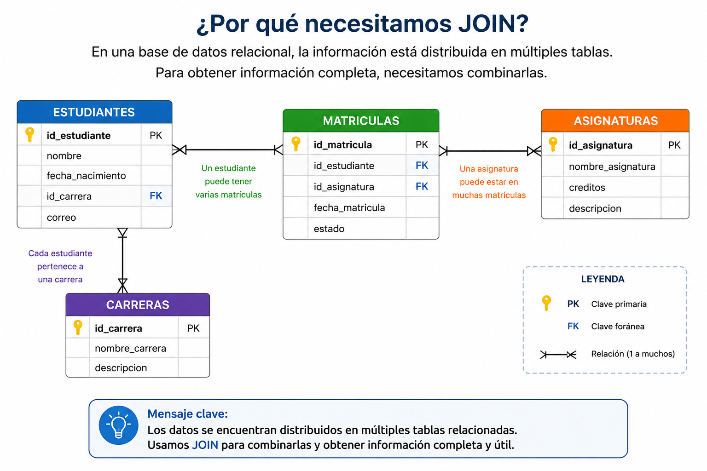
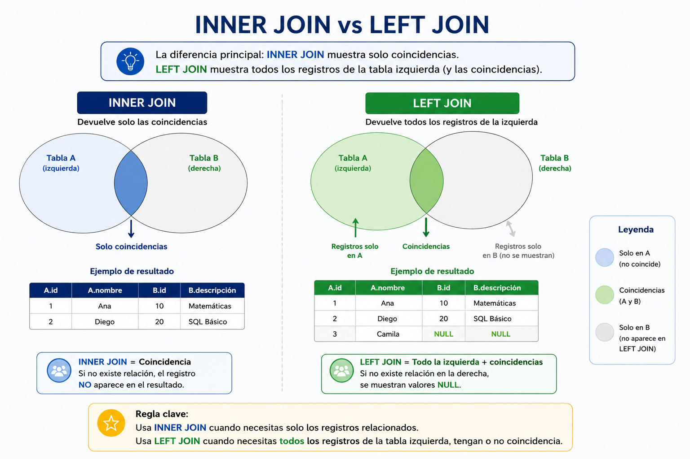
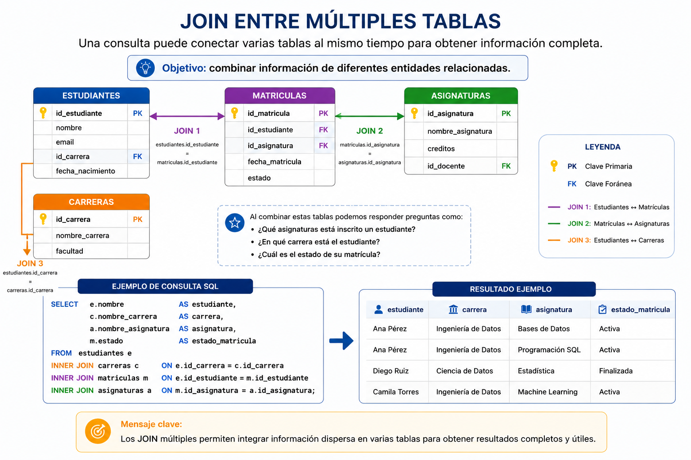
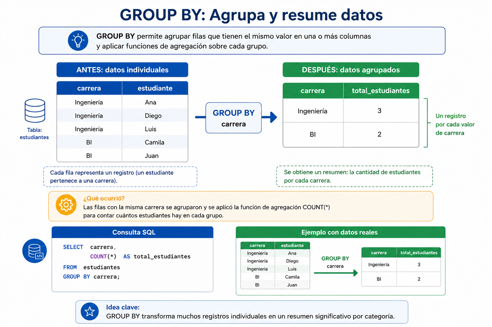
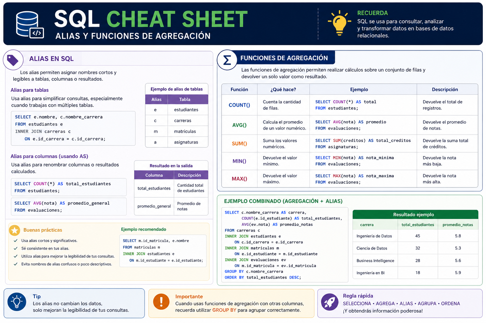

# Sesión 3

# JOIN y Agregaciones en SQL

**Duración:** 4 horas  
**Modalidad:** Online sincrónica  
**Entorno práctico:** Oracle APEX (cloud)  
**RAA dominante:** RAA2  

# Descripción de la jornada

La presente sesión tiene como propósito desarrollar consultas SQL relacionales utilizando `JOIN`, funciones de agregación y agrupamiento de datos. A partir del modelo académico implementado en Oracle APEX, los estudiantes aprenderán a combinar información proveniente de distintas tablas y a generar resultados útiles para el análisis académico y la toma de decisiones.

---

# Resultados de Aprendizaje de la Jornada

Al finalizar la sesión, el estudiante será capaz de:

- Comprender la utilidad de `JOIN` para consultar datos distribuidos en múltiples tablas.
- Aplicar `INNER JOIN` para relacionar tablas mediante claves primarias y foráneas.
- Utilizar alias para simplificar consultas SQL.
- Aplicar funciones de agregación como `COUNT`, `AVG`, `MIN` y `MAX`.
- Agrupar resultados mediante `GROUP BY`.
- Resolver consultas académicas básicas sobre estudiantes, carreras, asignaturas, matrículas y evaluaciones.

---

# Agenda de la Jornada

| Bloque               | Tiempo | Actividad |
| -------------------- | ------ | --------- |
| Exposición guiada    | 60 min | JOIN, alias, agregaciones y GROUP BY |
| Descanso             | 15 min | Break |
| Taller práctico      | 45 min | Consultas relacionales sobre el modelo académico |
| Revisión guiada      | 45 min | Solución paso a paso |
| Break                | 10 min | Pausa |
| Preguntas y revisión | 45 min | Dudas + revisión de consultas |

# Contenidos principales

## 1. ¿Por qué necesitamos JOIN?

En bases de datos relacionales, la información normalmente se encuentra distribuida en múltiples tablas relacionadas entre sí. Esta separación permite evitar duplicidad de datos, mejorar la organización de la información y mantener integridad dentro del sistema.

Por ejemplo, en nuestro modelo académico:

- la información de estudiantes se almacena en la tabla `estudiantes`;
- las carreras se almacenan en `carreras`;
- las asignaturas se encuentran en `asignaturas`;
- las matrículas se registran en `matriculas`;
- y las evaluaciones en `evaluaciones`.

Cada tabla cumple una función específica dentro del modelo relacional.

Sin embargo, en escenarios reales rara vez necesitamos analizar una sola tabla de manera aislada. Lo habitual es combinar información proveniente de distintas tablas para responder preguntas como:

- ¿Qué carrera estudia cada estudiante?
- ¿Qué asignaturas tiene cada matrícula?
- ¿Cuál es el promedio de notas por estudiante?
- ¿Cuántas evaluaciones existen por asignatura?

Aquí es donde aparece una de las operaciones más importantes de SQL: `JOIN`.

---

### 1.1 ¿Qué hace JOIN?

La instrucción `JOIN` permite combinar registros provenientes de dos o más tablas utilizando relaciones previamente definidas mediante claves primarias $(PK)$ y claves foráneas $(FK)$.

En términos simples:

> JOIN conecta tablas relacionadas para construir consultas más completas.

Por ejemplo:

- `estudiantes` se relaciona con `carreras`;
- `matriculas` se relaciona con `estudiantes`;
- `evaluaciones` se relaciona con `matriculas`.

Gracias a estas relaciones es posible reconstruir información compleja a partir de múltiples tablas simples.

---

### 1.2 Ejemplo conceptual

Supongamos las siguientes tablas:

**Tabla estudiantes**

| id_estudiante | nombre |
| ------------- | ------ |
| 1             | Camila |
| 2             | Diego  |
**Tabla carreras**

| id_carrera | nombre_carrera |
|---|---|
| 1 | Ingeniería de Datos |
| 2 | Analítica de Negocios |

Ahora imaginemos que la tabla `estudiantes` contiene además una clave foránea:

| id_estudiante | nombre | id_carrera |
|---|---|---|
| 1 | Camila | 1 |
| 2 | Diego | 2 |

A través de `JOIN`, SQL puede conectar ambas tablas y mostrar:

| nombre | nombre_carrera |
|---|---|
| Camila | Ingeniería de Datos |
| Diego | Analítica de Negocios |

---

### 1.3 JOIN dentro del ecosistema de datos

Las operaciones `JOIN` son fundamentales en:

- sistemas transaccionales;
- dashboards;
- reportes institucionales;
- procesos ETL;
- data warehouses;
- inteligencia de negocios;
- analítica de datos.

De hecho, gran parte de las consultas utilizadas en BI y análisis organizacional dependen directamente de relaciones entre múltiples tablas.

---

### 1.4 Importancia del modelamiento relacional

Mientras mejor diseñado esté el modelo relacional:

- más simples serán las consultas;
- más clara será la relación entre entidades;
- menor será la duplicidad de datos;
- más eficiente será el análisis posterior.

Por esta razón, comprender correctamente las relaciones entre tablas es un paso esencial antes de comenzar a construir consultas SQL complejas.



---

## 2. INNER JOIN

El tipo de JOIN más utilizado en SQL es `INNER JOIN`.

Esta operación permite combinar registros de dos tablas considerando únicamente aquellos datos que poseen coincidencia entre ambas.

En otras palabras: **INNER JOIN muestra solamente los registros relacionados.**

---

### 2.1 Sintaxis general

La estructura básica de un `INNER JOIN` es la siguiente:

```sql
SELECT columnas
FROM tabla_1
INNER JOIN tabla_2
    ON tabla_1.campo = tabla_2.campo;
````

---

### 2.2 Explicación de la estructura

**SELECT:** Indica las columnas que queremos visualizar.

**FROM:**  Define la tabla principal desde donde comienza la consulta.

**INNER JOIN:** Especifica la segunda tabla que será relacionada.

**ON:** Define la condición de relación entre ambas tablas.

Normalmente esta relación ocurre entre:

* clave primaria (`PK`);
* y clave foránea (`FK`).

---

### 2.3 Primer ejemplo práctico

Supongamos las siguientes tablas:

**Tabla estudiantes**

| id_estudiante | nombre | id_carrera |
| ------------- | ------ | ---------- |
| 1             | Camila | 1          |
| 2             | Diego  | 2          |

**Tabla carreras**

| id_carrera | nombre_carrera        |
| ---------- | --------------------- |
| 1          | Ingeniería de Datos   |
| 2          | Analítica de Negocios |

Queremos visualizar:

* el nombre del estudiante;
* y el nombre de su carrera.

Consulta SQL:

```sql
SELECT e.nombre,
       c.nombre_carrera
FROM estudiantes e
INNER JOIN carreras c
    ON e.id_carrera = c.id_carrera;
```

**Resultado esperado**

| nombre | nombre_carrera        |
| ------ | --------------------- |
| Camila | Ingeniería de Datos   |
| Diego  | Analítica de Negocios |

---

### 2.4 Uso de alias

En SQL es muy común utilizar alias para simplificar consultas.

En el ejemplo anterior:

```sql
estudiantes e
```

significa:

```sql
e = estudiantes
```

y:

```sql
c = carreras
```

Esto permite escribir consultas más limpias y fáciles de leer.

Por ejemplo:

```sql
e.nombre
```

equivale a:

```sql
estudiantes.nombre
```

> En la sección 4 se estudia en profundidad

---

### 2.5 ¿Por qué INNER JOIN es tan importante?

En bases de datos reales, la información suele encontrarse fragmentada en múltiples tablas.

Por ejemplo:

* estudiantes;
* docentes;
* asignaturas;
* matrículas;
* evaluaciones;
* sedes;
* carreras.

Las consultas analíticas requieren combinar permanentemente estas entidades.

Por ello:

> JOIN es uno de los pilares fundamentales de SQL.

Sin JOIN:

* no existirían dashboards complejos;
* no existirían reportes BI;
* no existirían modelos analíticos integrados.

---

### 2.6 Recomendaciones prácticas

Al trabajar con JOIN:

* identificar correctamente las PK y FK;
* utilizar alias;
* evitar nombres ambiguos;
* revisar cuidadosamente la condición `ON`;
* verificar que las relaciones sean coherentes.

Errores en JOIN pueden provocar:

* duplicidad de registros;
* resultados incorrectos;
* explosión de filas;
* análisis erróneos.

---

## 3. LEFT JOIN

Además de `INNER JOIN`, SQL dispone de otros tipos de relaciones entre tablas.

Uno de los más importantes es `LEFT JOIN`.

Este tipo de JOIN permite mostrar:

- todos los registros de la tabla izquierda;
- incluso cuando no exista coincidencia en la tabla derecha.

**Diferencia principal**

| Tipo       | Resultado                           |
| ---------- | ----------------------------------- |
| INNER JOIN | Solo registros con coincidencia     |
| LEFT JOIN  | Todos los registros de la izquierda |
**Sintaxis general**

```sql
SELECT columnas
FROM tabla1
LEFT JOIN tabla2
    ON tabla1.campo = tabla2.campo;
````

---

### 3.1 Ejemplo práctico

Supongamos que queremos visualizar:

* todos los estudiantes;
* junto con sus evaluaciones.

Sin embargo, algunos estudiantes todavía no poseen evaluaciones registradas.

Consulta SQL:

```sql
SELECT e.nombre,
       ev.nota
FROM estudiantes e
LEFT JOIN evaluaciones ev
    ON e.id_estudiante = ev.id_estudiante;
```

**¿Qué ocurre aquí?**

* `estudiantes` es la tabla izquierda;
* `evaluaciones` es la tabla derecha;
* todos los estudiantes aparecerán en el resultado;
* incluso si no tienen notas registradas.

Cuando no exista coincidencia:

* SQL mostrará `NULL`.

**Resultado esperado**

| nombre   | nota |
| -------- | ---- |
| Camila   | 6.5  |
| Diego    | 5.8  |
| Fernanda | NULL |

En este ejemplo:

* Fernanda existe en la tabla estudiantes;
* pero aún no posee evaluaciones.

---

### 3.2 ¿Cuándo se utiliza LEFT JOIN?

`LEFT JOIN` es muy utilizado en:

* reportes académicos;
* dashboards;
* análisis institucionales;
* detección de registros faltantes;
* monitoreo de procesos.

Por ejemplo:

* estudiantes sin matrícula;
* asignaturas sin docente;
* clientes sin compras;
* productos sin ventas.

---

### 3.3 Consideraciones importantes

Al trabajar con `LEFT JOIN`:

* la tabla más importante debe ubicarse a la izquierda;
* es normal encontrar valores `NULL`;
* se debe revisar cuidadosamente la condición `ON`.

Un JOIN mal definido puede provocar:

* duplicidad de datos;
* pérdida de registros;
* análisis incorrectos.



---

## 4. Alias en SQL

A medida que las consultas SQL comienzan a trabajar con múltiples tablas, los nombres completos de las columnas pueden volverse extensos y difíciles de leer.

Por esta razón, SQL permite utilizar alias.

Un alias corresponde a un nombre temporal y abreviado asignado a:

- tablas;
- columnas;
- resultados de funciones.

El objetivo principal de los alias es mejorar la claridad y legibilidad de las consultas.

---

### 4.1 Alias para tablas

En consultas con `JOIN`, es muy común asignar alias cortos a las tablas.

Ejemplo:

```sql
SELECT e.nombre,
       c.nombre_carrera
FROM estudiantes e
INNER JOIN carreras c
    ON e.id_carrera = c.id_carrera;
````

En este caso:

| Alias | Tabla       |
| ----- | ----------- |
| `e`   | estudiantes |
| `c`   | carreras    |

Por lo tanto:

```sql
e.nombre
```

equivale a:

```sql
estudiantes.nombre
```

---

### 4.2 ¿Por qué utilizar alias?

El uso de alias permite:

* simplificar consultas;
* mejorar legibilidad;
* reducir escritura repetitiva;
* facilitar consultas complejas;
* evitar ambigüedad entre columnas.

Por ejemplo, sin alias la consulta anterior sería:

```sql
SELECT estudiantes.nombre,
       carreras.nombre_carrera
FROM estudiantes
INNER JOIN carreras
    ON estudiantes.id_carrera = carreras.id_carrera;
```

Aunque ambas consultas son válidas, la versión con alias resulta:

* más limpia;
* más corta;
* más fácil de mantener.

---

### 4.3 Alias para columnas

Los alias también pueden utilizarse para renombrar columnas dentro del resultado de una consulta.

Ejemplo:

```sql
SELECT COUNT(*) AS total_estudiantes
FROM estudiantes;
```

En este caso:

* `AS` asigna un nombre temporal;
* el resultado aparecerá como `total_estudiantes`.

---

### 4.4 Ejemplo con funciones de agregación

```sql
SELECT AVG(nota) AS promedio_general
FROM evaluaciones;
```

La consulta anterior:

* calcula el promedio de notas;
* y presenta el resultado utilizando el nombre `promedio_general`.

> Las funciones de agregación se estudian en profundidad en la sección 6

---

### 4.5 Buenas prácticas

Al utilizar alias se recomienda:

* utilizar nombres cortos y claros;
* mantener consistencia;
* evitar abreviaturas confusas;
* utilizar alias especialmente en consultas con múltiples JOIN.

Por ejemplo:

| Recomendado       | Evitar          |
| ----------------- | --------------- |
| `e` = estudiantes | `x1`            |
| `c` = carreras    | `abc`           |
| `m` = matriculas  | `tabla_final_1` |

---

### 4.6 Importancia en análisis de datos

En consultas analíticas y procesos de Business Intelligence, los alias son ampliamente utilizados para:

* simplificar dashboards;
* mejorar reportes;
* construir métricas;
* facilitar lectura de resultados;
* organizar consultas complejas.

Por esta razón, el uso correcto de alias constituye una práctica fundamental dentro del trabajo profesional con SQL.

---

## 5. JOIN entre múltiples tablas

En escenarios reales, las consultas SQL normalmente requieren combinar más de dos tablas al mismo tiempo.

Por ejemplo, en el modelo académico puede ser necesario visualizar:

- el nombre del estudiante;
- la carrera a la que pertenece;
- la asignatura inscrita;
- y el estado de la matrícula.

Para lograr esto, SQL permite encadenar múltiples operaciones `JOIN`.

---

### 5.1 Ejemplo práctico

La siguiente consulta combina:

- `estudiantes`;
- `carreras`;
- `matriculas`;
- `asignaturas`.

```sql
SELECT e.nombre,
       c.nombre_carrera,
       a.nombre_asignatura,
       m.estado
FROM estudiantes e
INNER JOIN carreras c
    ON e.id_carrera = c.id_carrera
INNER JOIN matriculas m
    ON e.id_estudiante = m.id_estudiante
INNER JOIN asignaturas a
    ON m.id_asignatura = a.id_asignatura;
````

---

**Explicación de la consulta**

La consulta anterior realiza las siguientes relaciones:

| Tabla                    | Relación                  |
| ------------------------ | ------------------------- |
| estudiantes → carreras   | carrera del estudiante    |
| estudiantes → matriculas | matrículas del estudiante |
| matriculas → asignaturas | asignaturas inscritas     |

---

**Resultado esperado**

| nombre | nombre_carrera        | nombre_asignatura     | estado     |
| ------ | --------------------- | --------------------- | ---------- |
| Camila | Ingeniería de Datos   | SQL Básico            | Activa     |
| Diego  | Analítica de Negocios | Business Intelligence | Finalizada |

---

### 5.2 Importancia de los JOIN múltiples

En bases de datos organizacionales, la información suele encontrarse altamente fragmentada.

Por esta razón, consultas complejas requieren relacionar múltiples entidades simultáneamente.

Este tipo de consultas son fundamentales en:

* dashboards;
* reportes institucionales;
* inteligencia de negocios;
* sistemas ERP;
* data warehouses;
* analítica organizacional.

---

### 5.3 Recomendaciones prácticas

Al trabajar con múltiples JOIN se recomienda:

* utilizar alias cortos y claros;
* ordenar visualmente la consulta;
* revisar cuidadosamente las relaciones;
* verificar las PK y FK involucradas;
* probar progresivamente la consulta.

Por ejemplo:

1. primero unir dos tablas;
2. luego agregar una tercera;
3. finalmente incorporar nuevas relaciones.

Esto facilita detectar errores y comprender mejor el comportamiento de la consulta.

---

### 5.4 Buenas prácticas de legibilidad

En consultas complejas es recomendable:

* utilizar saltos de línea;
* alinear los JOIN;
* mantener indentación consistente;
* escribir consultas fáciles de leer.

Esto mejora:

* el mantenimiento;
* la depuración;
* y la colaboración entre equipos de trabajo.



---

## 6. Funciones de agregación

Las funciones de agregación permiten realizar cálculos sobre conjuntos de registros dentro de una tabla. Estas funciones son ampliamente utilizadas en análisis de datos, reportes y procesos de Business Intelligence.

A diferencia de una consulta tradicional, donde se visualizan registros individuales, las funciones de agregación permiten resumir información.

Por ejemplo:

- contar estudiantes;
- calcular promedios;
- sumar créditos;
- identificar notas máximas o mínimas.

---

### 6.1 Principales funciones de agregación

| Función | Propósito |
|---|---|
| `COUNT()` | Contar registros |
| `AVG()` | Calcular promedio |
| `SUM()` | Realizar sumas |
| `MIN()` | Obtener valor mínimo |
| `MAX()` | Obtener valor máximo |

---

### 6.2  COUNT()

La función `COUNT()` permite contar registros dentro de una tabla.

Ejemplo:

```sql
SELECT COUNT(*) AS total_estudiantes
FROM estudiantes;
````

La consulta anterior calcula:

* la cantidad total de estudiantes registrados.

---

### 6.3 AVG()

La función `AVG()` permite calcular promedios.

Ejemplo:

```sql
SELECT AVG(nota) AS promedio_notas
FROM evaluaciones;
```

La consulta anterior calcula:

* el promedio general de notas.

---

### 6.4 SUM()

La función `SUM()` permite sumar valores numéricos.

Ejemplo:

```sql
SELECT SUM(creditos) AS total_creditos
FROM asignaturas;
```

La consulta anterior calcula:

* la suma total de créditos de todas las asignaturas.

---

### 6.5 MIN() y MAX()

Estas funciones permiten identificar:

* el valor mínimo;
* y el valor máximo.

Ejemplo:

```sql
SELECT MIN(nota) AS nota_minima,
       MAX(nota) AS nota_maxima
FROM evaluaciones;
```

La consulta anterior muestra:

* la nota más baja;
* y la nota más alta registrada.

---

### 6.6 Importancia de las agregaciones

Las funciones de agregación son fundamentales en:

* dashboards;
* indicadores institucionales;
* análisis académicos;
* sistemas BI;
* reportes ejecutivos;
* minería de datos.

Por ejemplo:

* promedio de notas por carrera;
* cantidad de estudiantes matriculados;
* total de asignaturas activas;
* distribución de evaluaciones.

---

### 6.7 Consideraciones importantes

Al trabajar con funciones de agregación:

* los resultados suelen representar resúmenes;
* las columnas numéricas son las más utilizadas;
* frecuentemente se combinan con `GROUP BY`.

Las agregaciones permiten transformar datos operacionales en información útil para análisis y toma de decisiones.

---

## 7. GROUP BY

La cláusula `GROUP BY` permite agrupar registros que poseen un valor común dentro de una o más columnas. Esta operación resulta especialmente útil cuando se trabaja con funciones de agregación como:

- `COUNT()`
- `AVG()`
- `SUM()`
- `MIN()`
- `MAX()`

En términos simples:

> GROUP BY permite resumir información por categorías.

Por ejemplo:

- cantidad de estudiantes por carrera;
- promedio de notas por asignatura;
- total de matrículas por año;
- cantidad de evaluaciones por estudiante.

---

### 7.1 Sintaxis general

```sql
SELECT columna,
       funcion_agregacion()
FROM tabla
GROUP BY columna;
````

---

### 7.2 Ejemplo básico

Supongamos que queremos conocer:

* cuántos estudiantes existen por carrera.

Consulta SQL:

```sql
SELECT id_carrera,
       COUNT(*) AS total_estudiantes
FROM estudiantes
GROUP BY id_carrera;
```

---

**Explicación**

La consulta:

* agrupa los registros según `id_carrera`;
* luego cuenta cuántos estudiantes existen en cada grupo.

---

**Resultado esperado**

| id_carrera | total_estudiantes |
| ---------- | ----------------- |
| 1          | 15                |
| 2          | 22                |
| 3          | 9                 |

---

### 7.3 Ejemplo con promedio

También es posible calcular promedios por grupo.

Por ejemplo:

* promedio de notas por matrícula.

```sql
SELECT id_matricula,
       AVG(nota) AS promedio
FROM evaluaciones
GROUP BY id_matricula;
```

---

**Resultado esperado**

| id_matricula | promedio |
| ------------ | -------- |
| 1            | 5.8      |
| 2            | 6.1      |
| 3            | 4.9      |

---

### 7.4 Importancia de GROUP BY

La cláusula `GROUP BY` es ampliamente utilizada en:

* dashboards;
* reportes institucionales;
* indicadores académicos;
* inteligencia de negocios;
* análisis organizacional;
* minería de datos.

Gran parte de los reportes utilizados por las organizaciones se construyen utilizando agrupamiento y agregaciones.

---

### 7.5 Consideraciones importantes

Al trabajar con `GROUP BY`:

* todas las columnas que aparecen en `SELECT`
  y que no utilizan funciones de agregación
  deben aparecer también en `GROUP BY`;

* las funciones de agregación operan sobre cada grupo generado;

* el agrupamiento transforma múltiples registros en resultados resumidos.

---

### 7.6 Ejemplo aplicado al modelo académico

```sql
SELECT a.nombre_asignatura,
       COUNT(*) AS total_matriculas
FROM matriculas m
INNER JOIN asignaturas a
    ON m.id_asignatura = a.id_asignatura
GROUP BY a.nombre_asignatura;
```

La consulta anterior muestra:

* cada asignatura;
* junto con la cantidad total de estudiantes matriculados.

---

### 7.7 Buenas prácticas

Al utilizar `GROUP BY` se recomienda:

* utilizar alias claros;
* mantener consultas ordenadas;
* verificar correctamente los JOIN;
* revisar que las agregaciones tengan sentido analítico.

Esto facilita:

* la interpretación de resultados;
* la construcción de reportes;
* y el análisis de información organizacional.



---
## Guía rápida de consulta SQL

Antes de continuar con la actividad práctica, revisa el siguiente resumen visual con algunos de los conceptos más importantes trabajados en esta sesión.



# Actividad práctica - Consultas relacionales y agregaciones

## Contexto

La universidad ahora necesita analizar información académica almacenada en múltiples tablas relacionadas dentro del sistema.

Para ello, será necesario combinar datos de estudiantes, carreras, matrículas, asignaturas y evaluaciones utilizando consultas SQL relacionales.

Cada grupo deberá:

- realizar consultas utilizando **INNER JOIN**;
- identificar registros utilizando **LEFT JOIN**;
- aplicar **alias** para simplificar consultas;
- combinar información desde múltiples tablas;
- utilizar **funciones de agregación**;
- generar resúmenes utilizando **GROUP BY**.

---

## Parte 1 — INNER JOIN

### Ejercicio 1

Mostrar:

- nombre del estudiante;
- nombre de la carrera.

Tablas involucradas:

- estudiantes;
- carreras.

---

### Ejercicio 2

Mostrar:

- nombre del estudiante;
- nombre de la asignatura;
- semestre;
- año.

Tablas involucradas:

- estudiantes;
- matriculas;
- asignaturas.

---

## Parte 2 — LEFT JOIN

### Ejercicio 3

Mostrar todas las asignaturas, incluso aquellas que no poseen matrículas registradas.

Debe visualizar:

- nombre_asignatura;
- id_matricula.

---

### Ejercicio 4

Mostrar todos los estudiantes, incluyendo aquellos que no poseen matrículas registradas.

Debe visualizar:

- nombre del estudiante;
- id_matricula.

---

## Parte 3 — Alias

### Ejercicio 5

Reescribir la siguiente consulta utilizando alias:

```sql id="92l6ku"
SELECT estudiantes.nombre,
       carreras.nombre_carrera
FROM estudiantes
INNER JOIN carreras
ON estudiantes.id_carrera = carreras.id_carrera;
````

---

## Parte 4 — JOIN múltiples

### Ejercicio 6

Mostrar en una única tabla:

- estudiante;
- carrera;
- asignatura;
- docente.

Tablas involucradas:

- estudiantes;
- carreras;
- matriculas;
- asignaturas;
- docentes.    

---

## Parte 5 — Funciones de agregación

### Ejercicio 7

Calcular:

- cantidad total de estudiantes registrados.    

---

### Ejercicio 8

Calcular:

- promedio general de notas.

---

### Ejercicio 9

Calcular:

- suma total de créditos de asignaturas.

---

### Ejercicio 10

Obtener:

- nota máxima registrada;
- nota mínima registrada.

---

## Parte 6 — GROUP BY

### Ejercicio 11

Mostrar:

- cantidad de estudiantes por carrera.

---

### Ejercicio 12

Mostrar:

- promedio de notas por matrícula.

---

### Ejercicio 13

Mostrar:

- cantidad de asignaturas dictadas por docente.

---

### Ejercicio 14

Construir una consulta que muestre:

- nombre del estudiante;
- carrera;
- asignatura;
- docente;
- promedio de notas.

La consulta debe utilizar:

- múltiples JOIN;
- alias;
- AVG();
- GROUP BY.

---

## Recomendaciones

Durante el desarrollo de la actividad:

- utilizar alias claros;
- verificar relaciones PK/FK;
- mantener consultas ordenadas;
- ejecutar consultas paso a paso;
- validar resultados obtenidos.

---

## Resultado esperado

Al finalizar la actividad, el estudiante será capaz de:

- combinar información desde múltiples tablas;
- utilizar consultas relacionales;
- resumir información mediante agregaciones;
- construir consultas SQL orientadas al análisis de datos.

---
