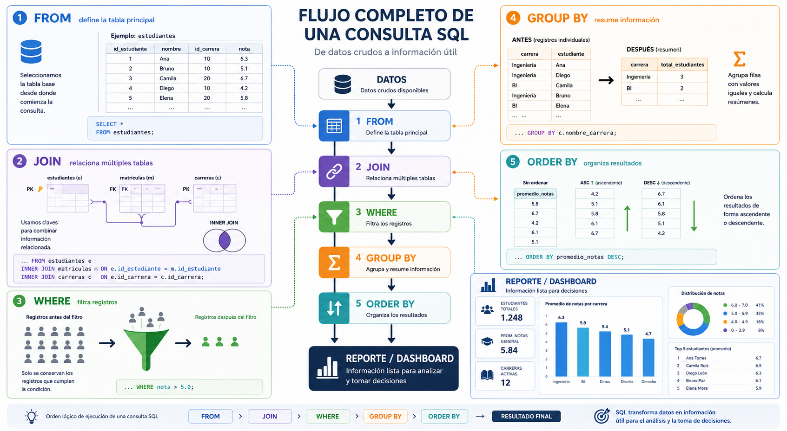

# Sesión 4
## Objetivo de aprendizaje

Aplicar consultas SQL integrando múltiples tablas, filtros, funciones de agregación y agrupamiento de datos para resolver problemas de análisis académico en un contexto universitario.


---

# Descripción de la jornada

En esta sesión los estudiantes comenzarán a utilizar SQL como una herramienta de análisis de información, integrando consultas relacionales, filtros y agregaciones para resolver problemas académicos reales.

A partir del modelo académico implementado en Oracle APEX, se desarrollarán consultas orientadas a responder preguntas institucionales relacionadas con estudiantes, carreras, asignaturas, matrículas, docentes y evaluaciones.

La sesión se enfocará principalmente en:

- construcción de consultas más completas;
- combinación de múltiples operaciones SQL;
- aplicación de filtros;
- generación de resúmenes;
- organización de resultados;
- elaboración de reportes básicos.

El objetivo principal será comprender cómo SQL permite transformar datos operacionales en información útil para análisis y toma de decisiones.

---

# Agenda de la Jornada

| Bloque | Tiempo | Actividad |
|---|---|---|
| Exposición guiada | 60 min | Consultas aplicadas, filtros y reportes SQL |
| Descanso | 15 min | Break |
| Taller práctico | 45 min | Desarrollo de consultas académicas |
| Revisión guiada | 45 min | Resolución paso a paso |
| Break | 10 min | Pausa |
| Preguntas y revisión | 45 min | Dudas y revisión de consultas |

---

# 1. SQL como herramienta de análisis

En sesiones anteriores trabajamos:

- modelamiento relacional;
- creación de estructuras;
- consultas básicas;
- JOIN;
- agregaciones;
- y agrupamiento de datos.

En esta sesión utilizaremos estos conocimientos para resolver consultas orientadas al análisis de información académica.

En contextos organizacionales, SQL no solo se utiliza para almacenar datos. También constituye una herramienta fundamental para:

- construir reportes;
- analizar información;
- generar indicadores;
- detectar patrones;
- apoyar procesos de toma de decisiones.

Por ejemplo, una universidad puede utilizar SQL para responder preguntas como:

- ¿Qué carrera posee más estudiantes matriculados?
- ¿Qué asignaturas presentan menor promedio?
- ¿Qué docentes poseen mayor cantidad de cursos?
- ¿Qué estudiantes aún no poseen evaluaciones?
- ¿Cuántas matrículas existen por semestre?

> Todas estas preguntas pueden resolverse mediante consultas SQL construidas sobre múltiples tablas relacionadas. Aquí vemos que tan **"poderoso"** es nuestro modelo de datos.


---

# 2. WHERE avanzado

La cláusula `WHERE` permite filtrar registros dentro de una consulta SQL.

En sesiones anteriores utilizamos filtros simples, por ejemplo:

```sql
SELECT *
FROM estudiantes
WHERE edad > 22;
```

Sin embargo, SQL dispone de operadores más avanzados que permiten construir consultas mucho más precisas y útiles para análisis de información.

---

### 2.1 LIKE

El operador `LIKE` permite buscar patrones dentro de texto.

Se utiliza frecuentemente junto al símbolo `%`, que representa cualquier cantidad de caracteres.

Ejemplo:

```sql
SELECT *
FROM estudiantes
WHERE nombre LIKE 'A%';
```

La consulta anterior muestra:  estudiantes cuyo nombre comienza con la letra `A`.

```sql
SELECT *
FROM asignaturas
WHERE nombre_asignatura LIKE '%Datos%';
```

La consulta anterior busca:  asignaturas que contengan la palabra `Datos`.

---

### 2.2 BETWEEN

El operador `BETWEEN` permite filtrar rangos de valores.

Ejemplo:

```sql
SELECT *
FROM evaluaciones
WHERE nota BETWEEN 5.0 AND 7.0;
```

La consulta anterior muestra: evaluaciones con notas entre 5.0 y 7.0.

---

### 2.3 IN

El operador `IN` permite comparar múltiples valores simultáneamente.

Ejemplo:

```sql
SELECT *
FROM carreras
WHERE nombre_carrera IN ('Ingeniería de Datos',
                         'Analítica de Negocios');
```

La consulta anterior muestra: únicamente las carreras indicadas (el operador AND se encuentra implícito)

---

### 2.4 IS NULL

El operador `IS NULL` permite identificar registros sin información asociada.

Ejemplo:

```sql
SELECT *
FROM estudiantes
WHERE correo IS NULL;
```

La consulta anterior muestra:  estudiantes que no poseen correo registrado.

---

### Buenas prácticas

Al trabajar con filtros SQL se recomienda:

* construir consultas progresivamente;
* validar resultados obtenidos;
* utilizar nombres claros;
* combinar filtros cuidadosamente;
* revisar tipos de datos involucrados.

Esto facilita:

* detectar errores;
* mejorar legibilidad;
* y construir consultas más robustas.

---


---

# 3. ORDER BY

La cláusula `ORDER BY` permite organizar los resultados de una consulta SQL.

Por defecto, las bases de datos no garantizan un orden específico en los resultados. Por esta razón, cuando se requiere visualizar información ordenada, es necesario utilizar `ORDER BY`.

Esta cláusula resulta especialmente útil en:

- reportes;
- dashboards;
- análisis académicos;
- ranking de resultados;
- visualización de indicadores.

---

### 3.1 ORDER BY con múltiples columnas

También es posible ordenar utilizando más de una columna.

Ejemplo:

```sql id="1gx70f"
SELECT *
FROM matriculas
ORDER BY anio DESC,
         semestre ASC;
```

La consulta anterior:

* ordena primero por año;
* y luego por semestre.

---

### 3.2 ORDER BY combinado con agregaciones

`ORDER BY` se utiliza frecuentemente junto a:

* `GROUP BY`;
* `COUNT()`;
* `AVG()`;
* `SUM()`.

Ejemplo:

```sql id="s6dzj3"
SELECT c.nombre_carrera,
       COUNT(*) AS total_estudiantes
FROM estudiantes e
INNER JOIN carreras c
    ON e.id_carrera = c.id_carrera
GROUP BY c.nombre_carrera
ORDER BY total_estudiantes DESC;
```

La consulta anterior:

* calcula la cantidad de estudiantes por carrera;
* y muestra primero las carreras con mayor cantidad de estudiantes.

---

### Buenas prácticas

Al utilizar `ORDER BY` se recomienda:

* ordenar resultados relevantes;
* utilizar alias claros;
* verificar correctamente los tipos de datos;
* aplicar ordenamiento especialmente en reportes y análisis.

Esto facilita:

* lectura de resultados;
* interpretación de información;
* y construcción de reportes más profesionales.

---


---

# 4. Consultas aplicadas en contextos reales

En escenarios organizacionales, las consultas SQL rara vez se utilizan de manera aislada. Lo habitual es combinar múltiples operaciones para responder preguntas concretas asociadas al análisis de información.

Por ejemplo, en una universidad puede ser necesario construir consultas para:

- identificar estudiantes con mejor rendimiento;
- calcular promedios por carrera;
- detectar asignaturas con mayor cantidad de matrículas;
- identificar estudiantes sin evaluaciones;
- generar rankings académicos;
- construir indicadores institucionales.

Este tipo de consultas combina normalmente:

- JOIN;
- WHERE;
- funciones de agregación;
- GROUP BY;
- ORDER BY.

---

### 4.1 Ejemplo 1

Supongamos que la universidad desea conocer:

- la cantidad de estudiantes por carrera;
- ordenados desde la carrera con más estudiantes.

Consulta SQL:

```sql
SELECT c.nombre_carrera,
       COUNT(*) AS total_estudiantes
FROM estudiantes e
INNER JOIN carreras c
    ON e.id_carrera = c.id_carrera
GROUP BY c.nombre_carrera
ORDER BY total_estudiantes DESC;
```


La consulta anterior:

* relaciona estudiantes y carreras;
* agrupa registros por carrera;
* cuenta estudiantes;
* y ordena los resultados de mayor a menor.

Resultado esperado

| nombre_carrera         | total_estudiantes |
| ---------------------- | ----------------- |
| Ingeniería de Datos    | 28                |
| Analítica de Negocios  | 22                |
| Ingeniería Informática | 18                |

---

### 4.2 Ejemplo 2

La universidad ahora necesita identificar:

* estudiantes que aún no poseen evaluaciones registradas.

Consulta SQL:

```sql id="2njlwm"
SELECT e.nombre,
       ev.id_evaluacion
FROM estudiantes e
LEFT JOIN evaluaciones ev
    ON e.id_estudiante = ev.id_estudiante
WHERE ev.id_evaluacion IS NULL;
```

La consulta anterior:

* utiliza `LEFT JOIN`;
* conserva todos los estudiantes;
* y filtra únicamente aquellos que no poseen evaluaciones.

---

### 4.3 Ejemplo 3

Supongamos que la universidad necesita conocer:

- promedio de notas por asignatura;
- considerando únicamente asignaturas activas;
- ordenadas desde el mayor promedio.

Consulta SQL:

```sql
SELECT a.nombre_asignatura,
       AVG(ev.nota) AS promedio_notas
FROM asignaturas a
INNER JOIN matriculas m
    ON a.id_asignatura = m.id_asignatura
INNER JOIN evaluaciones ev
    ON m.id_matricula = ev.id_matricula
GROUP BY a.nombre_asignatura
ORDER BY promedio_notas DESC;
```

La consulta anterior:

* relaciona asignaturas, matrículas y evaluaciones;
* calcula el promedio de notas;
* agrupa resultados por asignatura;
* y ordena los resultados desde el promedio más alto.

Resultado esperado

| nombre_asignatura     | promedio_notas |
| --------------------- | -------------- |
| Minería de Datos      | 6.4            |
| SQL Avanzado          | 6.1            |
| Business Intelligence | 5.8            |

---

### Buenas prácticas

Al desarrollar consultas aplicadas se recomienda:

* construir consultas progresivamente;
* validar resultados parciales;
* utilizar alias;
* ordenar adecuadamente las consultas;
* verificar relaciones entre tablas;
* utilizar nombres descriptivos.

Esto facilita:

* depuración;
* interpretación;
* mantenimiento;
* y reutilización de consultas.

---

# 5. Construcción progresiva de consultas SQL

A medida que las consultas SQL aumentan en complejidad, resulta importante comprender el orden lógico utilizado para construirlas.

En escenarios reales, una consulta suele integrar:

- múltiples tablas;
- filtros;
- agregaciones;
- agrupamientos;
- ordenamiento de resultados.

Por esta razón, es recomendable construir las consultas de manera progresiva y organizada.

En términos prácticos, muchas consultas siguen una estructura similar a la siguiente:

```text
FROM
→ JOIN
→ WHERE
→ GROUP BY
→ ORDER BY
```

---

### 5.1 Ejemplo 1

La siguiente consulta integra múltiples elementos trabajados durante la sesión.

```sql
SELECT c.nombre_carrera,
       AVG(ev.nota) AS promedio_notas
FROM estudiantes e
INNER JOIN carreras c
    ON e.id_carrera = c.id_carrera
INNER JOIN matriculas m
    ON e.id_estudiante = m.id_estudiante
INNER JOIN evaluaciones ev
    ON m.id_matricula = ev.id_matricula
WHERE ev.nota >= 4.0
GROUP BY c.nombre_carrera
ORDER BY promedio_notas DESC;
```

---

### Explicación paso a paso

La consulta anterior:

1. parte desde estudiantes;
2. relaciona carreras;
3. relaciona matrículas;
4. relaciona evaluaciones;
5. filtra notas mayores o iguales a 4.0;
6. calcula promedios;
7. agrupa por carrera;
8. ordena resultados de mayor a menor.

---

### Resultado esperado

| nombre_carrera         | promedio_notas |
| ---------------------- | -------------- |
| Ingeniería de Datos    | 6.1            |
| Analítica de Negocios  | 5.7            |
| Ingeniería Informática | 5.4            |

---

### Importancia del enfoque progresivo

Construir consultas paso a paso permite:

* detectar errores más fácilmente;
* validar relaciones;
* comprender mejor el comportamiento de SQL;
* mantener consultas más ordenadas;
* facilitar mantenimiento posterior.

Este enfoque es ampliamente utilizado en:

* análisis de datos;
* ingeniería de datos;
* Business Intelligence;
* desarrollo de dashboards;
* minería de datos.

---

### Buenas prácticas

Al construir consultas complejas se recomienda:

* comenzar desde una consulta simple;
* agregar JOIN progresivamente;
* validar filtros;
* probar agregaciones por separado;
* ordenar correctamente la consulta;
* utilizar alias claros.

Esto facilita:

* interpretación;
* depuración;
* reutilización;
* y trabajo colaborativo.

---



---

# Actividad práctica — Consultas SQL aplicadas

## Contexto

La universidad necesita comenzar a construir reportes académicos utilizando la información almacenada en su sistema institucional.

Para ello, será necesario desarrollar consultas SQL capaces de:

- relacionar múltiples tablas;
- filtrar información;
- resumir resultados;
- ordenar datos;
- y generar indicadores académicos básicos.

Cada grupo deberá trabajar utilizando el modelo académico implementado en Oracle APEX.

---

# Parte 1 — Consultas con filtros

## Ejercicio 1

Mostrar todos los estudiantes cuyo nombre comience con la letra “A”.

Utilizar:

- `LIKE`.

---

## Ejercicio 2

Mostrar todas las evaluaciones con notas entre 5.0 y 7.0.

Utilizar:

- `BETWEEN`.

---

## Ejercicio 3

Mostrar todas las carreras cuyo nombre corresponda a:

- Ingeniería de Datos;
- Analítica de Negocios.

Utilizar:

- `IN`.

---

## Ejercicio 4

Mostrar estudiantes que no poseen correo registrado.

Utilizar:

- `IS NULL`.

---

# Parte 2 — Consultas con ORDER BY

## Ejercicio 5

Mostrar todas las evaluaciones ordenadas desde la nota más alta a la más baja.

Utilizar:

- `ORDER BY DESC`.

---

## Ejercicio 6

Mostrar matrículas ordenadas:

- primero por año;
- luego por semestre.

---

# Parte 3 — Consultas analíticas

## Ejercicio 7

Mostrar la cantidad de estudiantes por carrera.

La consulta debe utilizar:

- `JOIN`;
- `COUNT()`;
- `GROUP BY`;
- `ORDER BY`.

---

## Ejercicio 8

Mostrar el promedio de notas por asignatura.

La consulta debe utilizar:

- `AVG()`;
- múltiples JOIN;
- `GROUP BY`.

---

## Ejercicio 9

Mostrar la cantidad de asignaturas dictadas por cada docente.

La consulta debe utilizar:

- `COUNT()`;
- `GROUP BY`.

---

# Parte 4 — Consultas aplicadas

## Ejercicio 10

Identificar estudiantes que aún no poseen evaluaciones registradas.

La consulta debe utilizar:

- `LEFT JOIN`;
- `IS NULL`.

---

## Ejercicio 11

Mostrar:

- estudiante;
- carrera;
- asignatura;
- docente;
- promedio de notas.

La consulta debe integrar:

- múltiples JOIN;
- alias;
- `AVG()`;
- `GROUP BY`;
- `ORDER BY`.

---

## Ejercicio 12

La universidad necesita construir un reporte institucional que muestre:

- carrera;
- cantidad total de estudiantes;
- promedio general de notas;
- cantidad total de evaluaciones.

La consulta debe:

- integrar múltiples tablas;
- utilizar funciones de agregación;
- utilizar GROUP BY;
- ordenar resultados desde la carrera con mayor promedio.

---

# Recomendaciones

Durante el desarrollo de la actividad:

- construir consultas progresivamente;
- validar resultados parciales;
- utilizar alias claros;
- revisar relaciones PK/FK;
- ordenar correctamente las consultas.

---

# Resultado esperado

Al finalizar la actividad, el estudiante será capaz de:

- construir consultas SQL orientadas al análisis;
- generar reportes académicos básicos;
- integrar múltiples operaciones SQL;
- transformar datos en información útil para análisis institucional.

---


