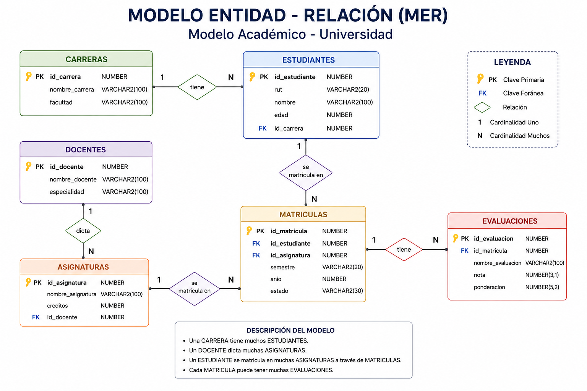

# Sesión 1

# De los datos al modelo relacional

**Asignatura:** Fundamentos de Ingeniería de Datos y SQL <br>
**Programa:** Diplomado en Ingeniería de Datos con Python<br>
**Duración:** 3 horas<br>
**Modalidad:** Online sincrónica<br>
**Entorno práctico:** Herramienta de diagramación / modelamiento<br>

## Objetivo de aprendizaje

Diseñar un modelo de datos relacional a partir de un problema organizacional, identificando entidades, atributos, claves primarias, claves foráneas, relaciones y cardinalidades.

---

# Descripción de la jornada

Esta primera sesión introduce el rol de la ingeniería de datos y los principios fundamentales del modelamiento relacional.

A partir de un caso organizacional, los estudiantes analizarán cómo una situación del mundo real puede representarse mediante entidades, atributos y relaciones, comprendiendo la función de las claves primarias y foráneas y la importancia de la integridad referencial.

La jornada tendrá un enfoque predominantemente práctico. Luego de una breve exposición conceptual, los estudiantes deberán diseñar un modelo relacional que posteriormente será implementado en Oracle APEX durante la Sesión 2.

---

# Agenda de la jornada

| Bloque                    |      Tiempo | Actividad                                                        |
| ------------------------- | ----------: | ---------------------------------------------------------------- |
| Exposición y demostración |  **45 min** | Ingeniería de datos y fundamentos del modelamiento relacional    |
| Break                     |  **15 min** | Descanso                                                         |
| Taller práctico           | **120 min** | Diseño progresivo de un modelo relacional                        |
| Cierre                    |  **15 min** | Revisión de soluciones, errores frecuentes y preparación para S2 |

---

# Bloque 1 — Exposición y demostración

## 19:15–20:00

### 1. ¿Dónde comienza la ingeniería de datos?

Las organizaciones generan datos permanentemente mediante ventas, clientes, transacciones, aplicaciones, sensores y múltiples sistemas de información.

Sin embargo, disponer de datos no significa disponer de información útil.

Antes de consultar, transformar o analizar datos es necesario determinar **cómo serán estructurados y relacionados**.

Un flujo simplificado puede representarse como:

**Problema → Datos → Modelo → Base de datos → SQL → Análisis**

El modelamiento constituye, por tanto, uno de los primeros pasos para construir soluciones confiables de ingeniería de datos.

### 2. Del mundo real al modelo de datos

Una organización no comienza pensando en tablas.

Comienza con conceptos del mundo real:

**Cliente — Producto — Venta — Pedido — Proveedor**

El modelamiento permite representar esos conceptos mediante estructuras que posteriormente podrán implementarse en una base de datos.

Presentar aquí la transformación:

**Objeto del mundo real → Entidad → Tabla**

**Característica → Atributo → Columna**

**Ocurrencia → Registro → Fila**

---

# 3. Entidades y atributos

Una **entidad** representa un objeto o concepto relevante para el sistema.

Por ejemplo:

**CLIENTE**

puede contener atributos como:

* identificador;
* nombre;
* correo;
* ciudad;
* fecha de registro.

Mientras que:

**PRODUCTO**

podría contener:

* identificador;
* nombre;
* categoría;
* precio;
* stock.

---

# 4. Claves primarias

Cada registro necesita ser identificado inequívocamente.

Por ejemplo:

```text
CLIENTES
------------------------
id_cliente      PK
nombre
correo
ciudad
```

La clave primaria:

* identifica un registro;
* no debe repetirse;
* permite posteriormente establecer relaciones.

> ¿Por qué sería problemático utilizar el nombre del cliente como clave primaria?

---

# 5. Relaciones y claves foráneas

Los datos adquieren mayor valor cuando pueden relacionarse.

Por ejemplo:

```text
CLIENTES
id_cliente PK
     │
     │
     ▼
VENTAS
id_venta PK
id_cliente FK
```

`id_cliente` permite establecer qué cliente realizó cada venta.

Introducir aquí la diferencia:

**PK → identifica.**

**FK → relaciona.**

---

# 6. Cardinalidad

**1 : 1**

**1 : N**

**N : M**

### Cliente — Venta

```text
CLIENTE 1 ───── N VENTAS
```

Un cliente puede realizar muchas ventas.

Cada venta corresponde a un cliente.

### Venta — Producto

```text
VENTAS N ───── N PRODUCTOS
```

Una venta puede contener varios productos y un producto puede aparecer en muchas ventas.

**¿Cómo representamos una relación N:M en una base de datos relacional?**



---

# Break

## 20:00–20:15

---

# Taller práctico

## 20:15–22:15

## Caso práctico — Sistema de gestión comercial

Una empresa comercializa productos a diferentes clientes y necesita organizar la información generada por sus operaciones.

Actualmente mantiene información de clientes, productos y ventas en diferentes archivos, dificultando conocer qué productos fueron adquiridos en cada transacción y quién realizó cada compra.

La empresa requiere diseñar una base de datos que permita registrar sus operaciones y posteriormente responder preguntas como:

* ¿qué productos compró cada cliente?;
* ¿cuántas ventas realizó cada cliente?;
* ¿qué productos presentan mayor demanda?;
* ¿cuánto dinero genera cada venta?;
* ¿qué productos se venden con mayor frecuencia?

Antes de implementar la base de datos, el equipo debe construir su modelo relacional.

---

# Etapa 1 — Identificar entidades

### 20 minutos

A partir del caso, identificar los principales objetos sobre los cuales necesitamos almacenar información.

---

# Etapa 2 — Resolver la relación Venta–Producto

### 25 minutos

Analizar:

> Una venta puede contener muchos productos y un producto puede aparecer en muchas ventas.

---

# Etapa 3 — Definir atributos

### 25 minutos

Cada grupo deberá proponer los atributos necesarios.

---

# Etapa 4 — Identificar PK y FK

### 20 minutos

---

# Etapa 5 — Definir cardinalidades

### 15 minutos

---

# Etapa 6 — Desafío de validación

### 15 minutos

Cada grupo deberá comprobar si su modelo puede responder:

1. ¿Quién realizó una determinada venta?
2. ¿Qué productos contiene una venta?
3. ¿En cuántas ventas aparece determinado producto?
4. ¿Cuántas unidades de un producto se vendieron?
5. ¿Cuánto dinero representa cada línea de venta?

Si el modelo no permite responder alguna pregunta, deberá ser revisado.

---

# Resultado esperado

Al finalizar la actividad, cada estudiante o grupo deberá disponer de:

* identificación de las cuatro entidades;
* atributos de cada entidad;
* claves primarias;
* claves foráneas;
* relaciones;
* cardinalidades;
* diagrama relacional completo.

El producto esperado será aproximadamente:

```text
CLIENTES
   1
   │
   N
VENTAS
   1
   │
   N
DETALLE_VENTAS
   N
   │
   1
PRODUCTOS
```

---

# Cierre de la sesión

## 22:15–22:30

* diferencias entre entidad y atributo;
* función de PK y FK;
* interpretación de cardinalidades;
* resolución de relaciones N:M;
* errores detectados durante el taller.

## Conexión con la Sesión 2

**Hoy diseñamos el modelo. En la próxima sesión lo convertiremos en una base de datos real.**

En la **Sesión 2**, implementarán este modelo en Oracle APEX mediante:

```text
CREATE TABLE
PRIMARY KEY
FOREIGN KEY
NOT NULL
Tipos de datos
```

---
