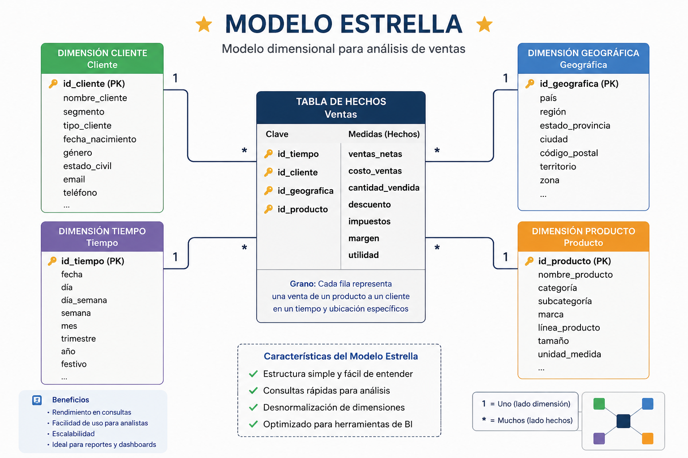
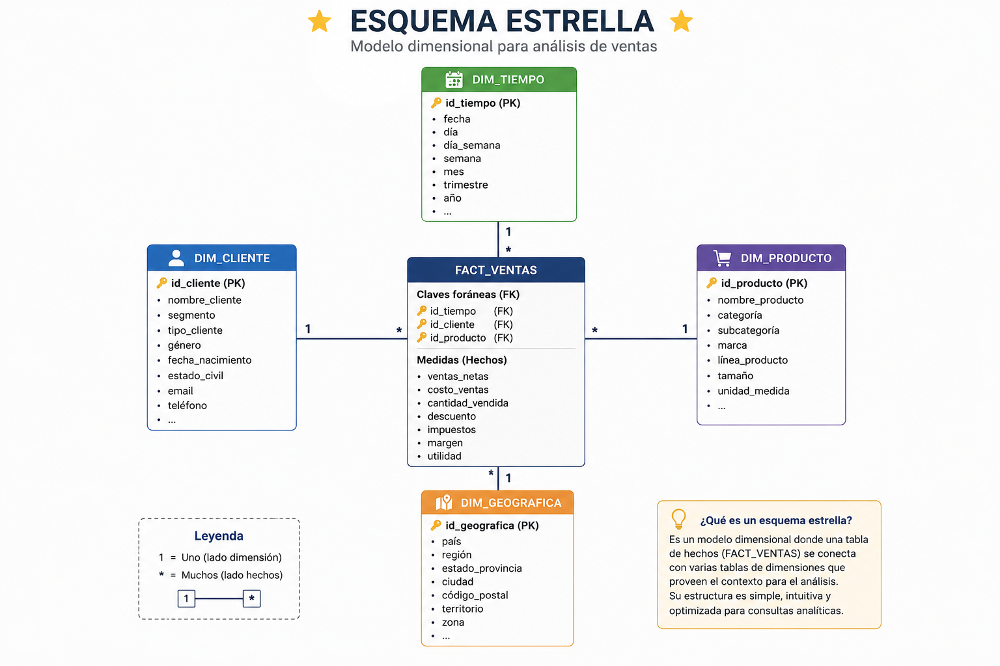
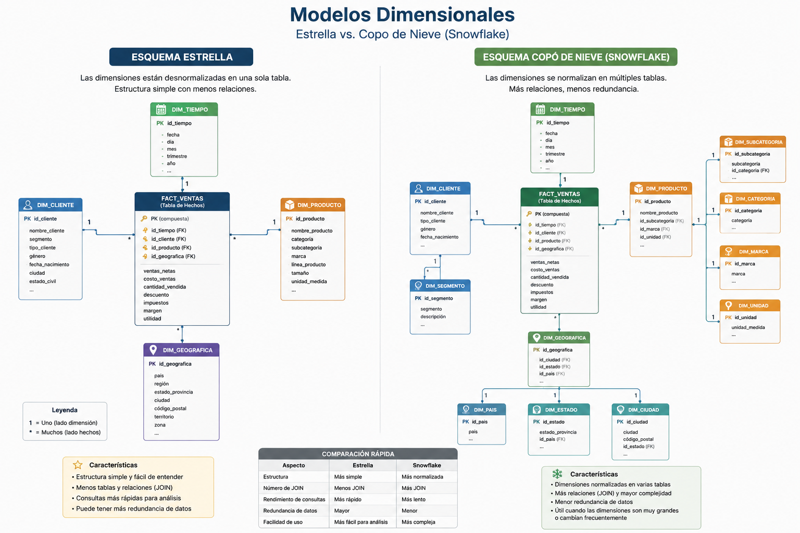

# Del modelo relacional al Data Warehouse

**Asignatura:** Fundamentos de Ingeniería de Datos y SQL<br>
**Duración:** 3 horas<br>
**Modalidad:** Online sincrónica<br>
**Entorno práctico:** Oracle APEX + herramienta de diagramación<br>

## Objetivo de aprendizaje

Diseñar un modelo dimensional a partir de una base de datos operacional, identificando procesos de negocio, hechos, dimensiones, medidas y granularidad, y aplicando los principios fundamentales de un esquema estrella orientado al análisis.

## Descripción de la jornada

Durante las primeras seis sesiones los estudiantes construyeron y utilizaron una base de datos relacional destinada a registrar clientes, productos y ventas.

Mediante SQL fue posible consultar las transacciones, relacionar tablas y generar indicadores comerciales.

En esta sesión se planteará una nueva necesidad: **analizar el comportamiento histórico del negocio de manera eficiente y desde diferentes perspectivas**.

A partir de esta problemática se introducirán los fundamentos de Data Warehouse y modelamiento dimensional. Los estudiantes transformarán conceptualmente el modelo operacional utilizado durante el curso en un modelo analítico compuesto por una tabla de hechos y diferentes dimensiones.

El foco no estará en memorizar definiciones, sino en comprender **por qué una estructura diseñada para registrar transacciones no necesariamente es la estructura más apropiada para analizarlas**.

# Agenda

| Bloque                    |      Tiempo | Actividad                                                                        |
| ------------------------- | ----------: | -------------------------------------------------------------------------------- |
| Exposición y demostración |  **45 min** | OLTP vs DW, hechos, dimensiones, medidas, granularidad, estrella y copo de nieve |
| Break                     |  **15 min** | Descanso                                                                         |
| Taller práctico           | **120 min** | Transformación del modelo comercial en modelo dimensional                        |
| Cierre                    |  **15 min** | Validación del modelo y preparación del ETL                                      |

# Bloque 1 — Exposición y demostración

## 19:15–20:00

## 1. Nuestro modelo funciona

```text
CLIENTES
   │
   ▼
VENTAS
   │
   ▼
DETALLE_VENTAS
   │
   ▼
PRODUCTOS
```

Podemos:

* registrar clientes;
* registrar productos;
* almacenar ventas;
* consultar transacciones;
* construir indicadores.

Por tanto:

> **¿Qué problema tenemos?**

En principio, ninguno.

El modelo funciona correctamente para el propósito para el cual fue diseñado.

Y ese punto es fundamental.

**No introducimos Data Warehouse porque el modelo relacional esté "mal".**

Introducimos Data Warehouse porque aparece **otro propósito**.

---

# 2. Operar y analizar no son exactamente lo mismo

Nuestro sistema responde muy bien preguntas operacionales:

> ¿Qué compró el cliente 15?

> ¿Qué productos pertenecen a la venta 203?

> ¿Cuál es el stock actual del producto 8?

Pero imaginemos que la empresa crece.

Ahora la gerencia solicita:

> ¿Cómo han evolucionado las ventas durante los últimos cinco años?

> ¿Qué categorías crecen más?

> ¿Qué meses presentan mayores ingresos?

> ¿Qué ciudades concentran nuestras ventas?

> ¿Cómo se comportan las categorías por período y ubicación?

La necesidad ha cambiado.

Visualmente:

```text
SISTEMA OPERACIONAL
Registrar lo que ocurre
        ↓
CLIENTES
PRODUCTOS
VENTAS
DETALLE
```

frente a:

```text
SISTEMA ANALÍTICO
Comprender lo que ocurrió
        ↓
Tiempo
Cliente
Producto
Ubicación
Ventas
```

---

# 3. OLTP y Data Warehouse

| Base operacional                 | Data Warehouse           |
| -------------------------------- | ------------------------ |
| Orientada a transacciones        | Orientado al análisis    |
| Estado actual                    | Información histórica    |
| Muchas operaciones INSERT/UPDATE | Principalmente consultas |
| Modelo normalizado               | Modelo dimensional       |
| Procesos operacionales           | Toma de decisiones       |
| Consultas específicas            | Análisis agregado        |

Una precisión importante:

> **Un Data Warehouse no reemplaza necesariamente la base operacional.**

Ambos cumplen funciones distintas.

---

# 4. Del modelo relacional al modelo dimensional

Presentar el cambio:

### Modelo operacional

```text
CLIENTES
VENTAS
DETALLE_VENTAS
PRODUCTOS
```

### Modelo dimensional



Esta imagen conceptual debe ser uno de los momentos centrales de la sesión.

No estamos simplemente cambiando nombres.

Estamos **reorganizando los datos según las preguntas que queremos responder**.

---

# 5. ¿Qué es un hecho?

> ¿Qué evento del negocio queremos analizar?

Respuesta:

**La venta.**

Más específicamente, podríamos analizar cada producto contenido en una venta.

La tabla central podría ser:

```text
FACT_VENTAS
```

Contendrá las observaciones cuantificables del proceso.

Por ejemplo:

```text
cantidad
precio_unitario
importe
```

Introducir entonces:

> **Un hecho representa un evento medible del negocio.**

---

# 6. ¿Qué es una medida?

> ¿Qué podemos medir sobre las ventas?

Por ejemplo:

```text
cantidad
importe
```

Podemos calcular:

```text
importe = cantidad × precio_unitario
```

Estas medidas posteriormente permitirán:

```text
SUM(importe)
SUM(cantidad)
AVG(importe)
```

---

# 7. ¿Qué es una dimensión?

> ¿Desde qué perspectivas queremos analizar las ventas?

Podemos preguntar:

**¿Cuándo?**

```text
DIM_TIEMPO
```

**¿Quién compró?**

```text
DIM_CLIENTE
```

**¿Qué compró?**

```text
DIM_PRODUCTO
```

Conceptualmente:

```text
                 TIEMPO
                   │
                   │
CLIENTE ─────── VENTA ─────── PRODUCTO
```

> **Las dimensiones describen el contexto desde el cual analizamos los hechos.**

---

# 8. Granularidad

Este concepto merece atención especial.


> ¿Qué representa exactamente una fila de `FACT_VENTAS`?


**una venta completa**

o:

**un producto dentro de una venta.**

No es lo mismo.

> **Una fila de FACT_VENTAS representa un producto incluido en una venta determinada.**

Esta decisión permitirá analizar:

* productos;
* categorías;
* clientes;
* fechas;
* unidades;
* ingresos.

> **Antes de diseñar una tabla de hechos debemos definir su granularidad.**

---

# 9. Esquema estrella

Nuestro primer diseño:




### FACT_VENTAS

```text
id_tiempo
id_cliente
id_producto
id_venta
cantidad
precio_unitario
importe
```

### DIM_TIEMPO

```text
id_tiempo
fecha
dia
mes
nombre_mes
trimestre
anio
```

### DIM_CLIENTE

```text
id_cliente
nombre
ciudad
```

### DIM_PRODUCTO

```text
id_producto
nombre_producto
categoria
```

---

# 10. ¿Por qué DIM_TIEMPO?

En `VENTAS` teníamos:

```text
fecha_venta
```

Pero analíticamente queremos:

```text
día
mes
trimestre
año
```

Esto permitirá posteriormente preguntas como:

> ¿Cuánto vendimos por mes?

> ¿Qué trimestre tuvo mayores ingresos?

> ¿Cómo evolucionaron las ventas por año?

---

# 11. Estrella vs copo de nieve



Comparación muy breve:

| Estrella               | Snowflake         |
| ---------------------- | ----------------- |
| Más simple             | Más normalizado   |
| Menos JOIN             | Más relaciones    |
| Fácil para análisis    | Mayor complejidad |
| Dimensiones más anchas | Menor redundancia |

# Break

## 20:00–20:15

# Taller práctico

## 20:15–22:15

## Etapa 1

### 15 minutos

Entregar requerimientos:

> La gerencia necesita analizar las ventas históricas por año, trimestre y mes.

> Necesita comparar ingresos entre categorías de productos.

> Necesita determinar qué clientes generan mayores ingresos.

> Necesita analizar ventas según ciudad del cliente.

**¿Qué queremos medir?**

y:

**¿Desde qué perspectivas queremos analizarlo?**

---

# Etapa 2 — Identificar el proceso de negocio

### 15 minutos

Preguntas:

> ¿Cuál es el proceso que estamos analizando?

> ¿Qué evento concreto registrará una fila de nuestra tabla de hechos?

---

# Etapa 3 — Definir la granularidad

### 15 minutos

Cada grupo deberá redactar una frase:

> **Una fila de FACT_VENTAS representa...**

Resultado esperado:

> Una línea de producto asociada a una venta, realizada por un cliente en una fecha determinada.

Esta frase debe quedar escrita antes de continuar.

---

# Etapa 4 — Identificar medidas

### 15 minutos

A partir del modelo operacional:

```text
cantidad
precio_unitario
```

determinar qué medidas requiere el análisis.

Propuesta:

```text
cantidad
precio_unitario
impuesto
```

> ¿`nombre_producto` es una medida?

> ¿`categoria` es una medida?

> ¿`impuesto` es una medida?

---

# Etapa 5 — Identificar dimensiones

### 20 minutos

Los estudiantes deberán identificar las dimensiones necesarias para responder los requerimientos.

---

# Etapa 6 — Construcción del modelo estrella

### 20 minutos

Cada grupo construye gráficamente:

```text
                    DIM_TIEMPO
                         │
                         │
                         ▼
DIM_CLIENTE ─────── FACT_VENTAS ─────── DIM_PRODUCTO
```

Indicando:

* claves;
* atributos;
* medidas;
* relaciones.

---

# Etapa 7 — Validación mediante preguntas

### 10 minutos

Ahora probamos el modelo.

### Pregunta 1

> ¿Podemos calcular ingresos por año?

Necesitamos:

```text
FACT_VENTAS + DIM_TIEMPO
```

### Pregunta 2

> ¿Podemos calcular ingresos por categoría?

### Pregunta 3

> ¿Podemos calcular ingresos por ciudad?

### Pregunta 4

> ¿Podemos analizar categoría por mes?

Si el modelo no puede responder alguna pregunta requerida, debemos revisar el diseño.

---

# Etapa 8 — Estrella vs snowflake

### 10 minutos

> ¿Cuál utilizarían para nuestro caso y por qué?

# Desafío final

### 15 minutos

> **La gerencia informa que próximamente abrirá varias sucursales y necesitará comparar ventas por sucursal, ciudad y región.**

> ¿Nuestro modelo actual puede responder completamente ese requerimiento?

> ¿Cómo modificarían el modelo dimensional?

# Producto de la sesión

El producto será:

**`06_modelo_dimensional`**

compuesto por:

1. definición del proceso de negocio;
2. declaración explícita de granularidad;
3. identificación de medidas;
4. identificación de dimensiones;
5. modelo estrella;
6. breve justificación de las decisiones de diseño.

# Cierre

## 22:15–22:30

### Modelo operacional

```text
CLIENTES
VENTAS
DETALLE_VENTAS
PRODUCTOS
```

Diseñado fundamentalmente para:

**registrar transacciones.**

### Modelo dimensional

```text
                 DIM_TIEMPO
                      │
                      ▼
DIM_CLIENTE ─── FACT_VENTAS ─── DIM_PRODUCTO
```

Diseñado fundamentalmente para:

**analizar el negocio.**

## Puente hacia S8

> Tenemos la base operacional en un lado y acabamos de diseñar nuestro Data Warehouse en otro.

```text
BASE OPERACIONAL                 DATA WAREHOUSE

CLIENTES                         DIM_CLIENTE
PRODUCTOS                        DIM_PRODUCTO
VENTAS             ???           DIM_TIEMPO
DETALLE_VENTAS                   FACT_VENTAS
```

> **¿Cómo llevamos los datos desde un modelo hasta el otro?**

# Sesión 8 — ETL y construcción del Data Warehouse

