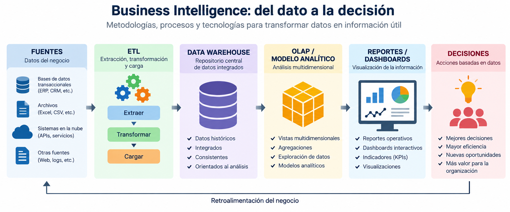
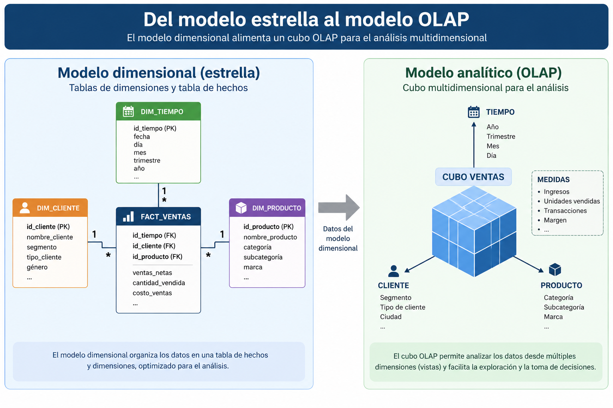
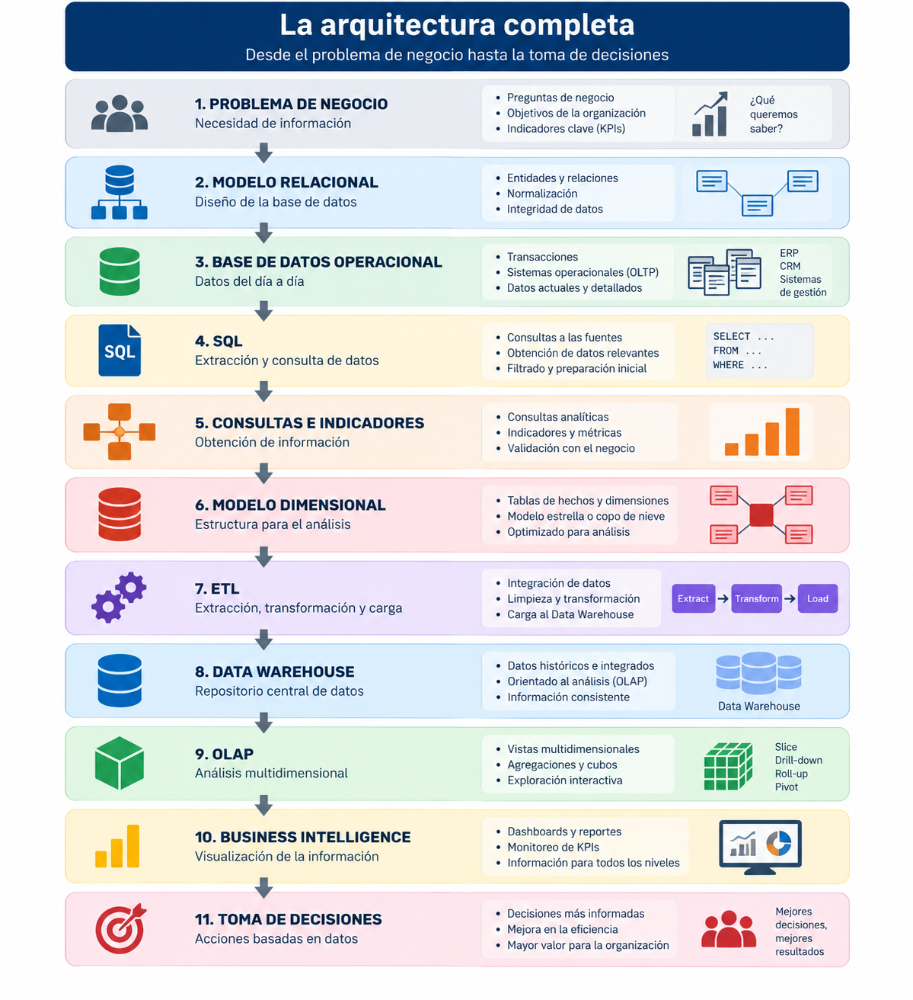

# Sesión 9

# OLAP, Business Intelligence e integración

**Asignatura:** Fundamentos de Ingeniería de Datos y SQL<br>
**Duración:** 3 horas<br>
**Modalidad:** Online sincrónica<br>
**Entorno práctico:** SQL Server + Visual Studio / SQL Server Analysis Services (SSAS)<br>

## Objetivo de aprendizaje

Implementar y explorar una estructura analítica multidimensional a partir del Data Warehouse construido, identificando dimensiones, medidas y jerarquías, y relacionando los componentes desarrollados durante el curso dentro de una arquitectura integrada de ingeniería de datos y Business Intelligence.

## Descripción de la jornada

Durante S7 los estudiantes diseñaron un modelo dimensional orientado al análisis y en S8 implementaron un proceso ETL para poblar sus dimensiones y tabla de hechos.

En esta sesión final se utilizará ese Data Warehouse como fuente para construir una estructura OLAP que permita analizar las ventas desde diferentes perspectivas.

Los estudiantes identificarán medidas, dimensiones y jerarquías, procesarán la estructura analítica y explorarán los resultados mediante operaciones multidimensionales.

Finalmente, se reconstruirá la arquitectura completa desarrollada durante el curso, desde el problema organizacional y la base operacional hasta el Data Warehouse y su explotación analítica.

# Agenda

| Bloque                    |      Tiempo | Actividad                                                           |
| ------------------------- | ----------: | ------------------------------------------------------------------- |
| Exposición + demostración |  **45 min** | BI, OLAP, dimensiones, medidas, jerarquías y arquitectura integrada |
| Break                     |  **15 min** | Descanso                                                            |
| Taller práctico           | **120 min** | Construcción y exploración de modelo OLAP                           |
| Cierre                    |  **15 min** | Integración S1–S9 y cierre del módulo                               |

# Bloque 1 — Exposición y demostración

## 19:15–20:00

## 1. ¿Dónde estamos?

```text
BASE OPERACIONAL
      │
      │
      ▼
     ETL
      │
      ▼
DATA WAREHOUSE
      │
      ├── DIM_CLIENTE
      ├── DIM_PRODUCTO
      ├── DIM_TIEMPO
      └── FACT_VENTAS
```

Nuestro Data Warehouse contiene información preparada para análisis.

Podemos ejecutar:

```sql
SELECT SUM(importe)
FROM FACT_VENTAS;
```

o:

```sql
SELECT p.categoria,
       SUM(f.importe)
FROM FACT_VENTAS f
INNER JOIN DIM_PRODUCTO p
    ON f.id_producto = p.id_producto
GROUP BY p.categoria;
```

SQL continúa funcionando perfectamente.

Entonces planteamos:

> ¿Cómo facilitamos que un usuario pueda analizar esta información repetidamente desde diferentes perspectivas?

---

# 2. Business Intelligence

> Business Intelligence comprende metodologías, procesos y tecnologías destinadas a transformar datos en información útil para apoyar la toma de decisiones. 

Pero ahora podemos mostrar dónde se ubica:



---

# 3. ¿Qué es OLAP?

Queremos analizar:

**¿Qué?**

```text
VENTAS
```

**¿Cuándo?**

```text
TIEMPO
```

**¿Qué producto?**

```text
PRODUCTO
```

**¿Quién compró?**

```text
CLIENTE
```

Visualmente:


---

# 4. Medidas

Nuestro modelo contiene:

```text
cantidad
precio_unitario
importe
```

Pero no todas tienen necesariamente el mismo comportamiento analítico.

Las medidas principales podrían ser:

```text
Unidades vendidas = SUM(cantidad)

Ingresos = SUM(importe)
```

Y podríamos agregar:

```text
Cantidad de transacciones
```

> **Las medidas representan aquello que queremos cuantificar.**

Las dimensiones representan:

> **desde qué perspectiva queremos analizarlo.**

---

# 5. Dimensiones

### DIM_PRODUCTO

```text
Producto
Categoría
```

### DIM_CLIENTE

```text
Cliente
Ciudad
```

### DIM_TIEMPO

```text
Fecha
Mes
Trimestre
Año
```

> Diseñamos dimensiones en S7 precisamente porque queríamos proporcionar perspectivas de análisis.

---

# 6. Jerarquías

En `DIM_TIEMPO` tenemos:

```text
Año
 ↓
Trimestre
 ↓
Mes
 ↓
Fecha
```

Esto constituye una jerarquía natural, y descender hacia:

```text
2026
 ├── Q1
 ├── Q2
 ├── Q3
 │    ├── Julio
 │    ├── Agosto
 │    └── Septiembre
 └── Q4
```

> **Una jerarquía permite navegar entre distintos niveles de detalle dentro de una dimensión.**

---

# 7. Drill-down y roll-up

### Roll-up

```text
Mes → Trimestre → Año
```

Menor nivel de detalle.

### Drill-down

```text
Año → Trimestre → Mes
```

Mayor nivel de detalle.

---

# 8. Slice y dice

### Slice

> Muéstreme solamente las ventas del año 2026.

Seleccionamos un valor de una dimensión.

### Dice

> Muéstreme ventas de Tecnología y Accesorios durante determinados meses de 2026.

Seleccionamos subconjuntos de diferentes dimensiones.

---

# 9. Del modelo estrella al modelo OLAP



---

# Break

## 20:00–20:15

# Taller práctico

## 20:15–22:15

# Etapa 1 — Crear proyecto Analysis Services

### 15 minutos

En Visual Studio:

1. crear proyecto de Analysis Services;
2. establecer conexión con `DW_COMERCIAL`;
3. crear Data Source;
4. verificar conexión.

---

# Etapa 2 — Data Source View

### 15 minutos

Incorporar:

```text
DIM_CLIENTE
DIM_PRODUCTO
DIM_TIEMPO
FACT_VENTAS
```

> ¿Por qué SSAS reconoce estas relaciones?

Porque las estructuras fueron diseñadas previamente.

---

# Etapa 3 — Construcción de dimensiones

### 20 minutos

Crear:

```text
DIM CLIENTE
DIM PRODUCTO
DIM TIEMPO
```

Incorporar atributos.

### Cliente

```text
Nombre
Ciudad
```

### Producto

```text
Nombre Producto
Categoría
```

### Tiempo

```text
Fecha
Mes
Trimestre
Año
```

---

# Etapa 4 — Jerarquía temporal

### 15 minutos

Construir:

```text
Año
 ↓
Trimestre
 ↓
Mes
 ↓
Fecha
```

---

# Etapa 5 — Construcción del cubo

### 20 minutos

Crear:

**`CUBO_VENTAS`**

Seleccionar la tabla:

```text
FACT_VENTAS
```

Definir medidas:

```text
Ingresos
Unidades Vendidas
```

y, si la configuración lo permite sin complicaciones innecesarias:

```text
Cantidad de registros / transacciones
```

Verificar relaciones con:

```text
DIM_CLIENTE
DIM_PRODUCTO
DIM_TIEMPO
```

---

# Etapa 6 — Procesar

### 10 minutos

Ejecutar procesamiento.

> **Que el proceso termine correctamente no significa todavía que el modelo sea correcto.**

Necesitamos validarlo.

---

# Etapa 7 — Primera exploración

### 15 minutos

Construir:

**Ingresos por categoría**

```text
Categoría             Ingresos
Tecnología             ...
Accesorios             ...
...
```

Luego:

**Ingresos por año**

```text
Año                    Ingresos
2025                    ...
2026                    ...
```

Comparar al menos una medida con SQL:

```sql
SELECT SUM(importe)
FROM FACT_VENTAS;
```

---

# Etapa 8 — Análisis multidimensional

### 10 minutos

Construir una matriz:

```text
                    2025       2026
Tecnología           ...        ...
Accesorios           ...        ...
Hogar                ...        ...
```

Estamos cruzando:

```text
DIM_PRODUCTO
      ×
DIM_TIEMPO
      ×
MEDIDA INGRESOS
```

# Desafío integrador

### 15 minutos

> **La gerencia necesita analizar la evolución de los ingresos y unidades vendidas por categoría de producto durante los distintos períodos disponibles. Además, necesita poder descender desde el año hasta el mes y filtrar los resultados según ciudad del cliente.**

# Producto de la sesión

El estudiante deberá finalizar con un modelo OLAP que incluya:

* fuente de datos;
* Data Source View;
* `DIM_CLIENTE`;
* `DIM_PRODUCTO`;
* `DIM_TIEMPO`;
* jerarquía temporal;
* `CUBO_VENTAS`;
* medida de ingresos;
* medida de unidades vendidas;
* evidencia de procesamiento;
* evidencia de análisis multidimensional.

**`07_modelo_olap_comercial`**

# Cierre final del curso

## 22:15–22:30

## S1 — Problema → Modelo

Diseñamos:

```text
CLIENTES
PRODUCTOS
VENTAS
DETALLE_VENTAS
```

## S2 — Modelo → Base de datos

Implementamos:

```text
Tablas
PK
FK
Restricciones
Datos
```

## S3 — Datos → Operaciones

Aprendimos:

```text
SELECT
WHERE
ORDER BY
INSERT
UPDATE
DELETE
```

## S4 — Datos relacionados

Construimos:

```text
INNER JOIN
LEFT JOIN
JOIN múltiples
```

## S5 — Datos → Indicadores

Utilizamos:

```text
COUNT
SUM
AVG
GROUP BY
HAVING
```

## S6 — Problema → Consulta

Resolvimos requerimientos mediante:

```text
Filtros
JOIN
Agregaciones
Subconsultas
```

## S7 — Operación → Análisis

Transformamos:

```text
MODELO RELACIONAL
       ↓
MODELO DIMENSIONAL
```

## S8 — Fuente → Data Warehouse

Construimos:

```text
EXTRACT
   ↓
TRANSFORM
   ↓
LOAD
```

## S9 — Data Warehouse → Análisis

Construimos:

```text
DIMENSIONES
     +
MEDIDAS
     +
JERARQUÍAS
     ↓
    OLAP
```

# La arquitectura completa


