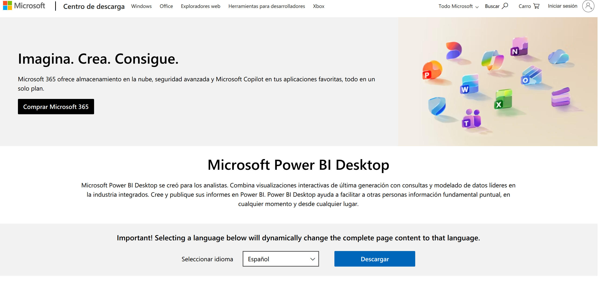
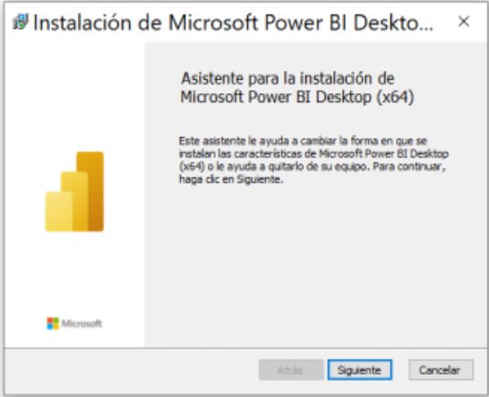

# Qué es y cómo instalar Power BI Desktop

## **¿Qué es Power BI Desktop?**

Power BI Desktop es una **aplicación gratuita de Windows** diseñada para conectarse a diversas fuentes de datos, transformarlos y crear informes visuales interactivos. Esta herramienta forma parte de la suite de Power BI, que trabaja en conjunto con el servicio Power BI (en línea) para la publicación y el uso compartido de los informes. 

Entre sus capacidades principales, con Power BI Desktop puedes:

*   **Importar datos** desde múltiples orígenes, como Excel, bases de datos locales y en la nube, y orígenes web.
*   **Limpiar y dar forma a los datos** utilizando la herramienta de autoservicio **Power Query**.
*   Construir modelos de datos avanzados y crear medidas personalizadas empleando el lenguaje de fórmulas **DAX (Data Analysis Expressions)**.
*   **Crear visualizaciones modernas** e interactivas utilizando herramientas de tematización, formato y diseño de arrastrar y soltar.
*   Aprovechar **herramientas de Inteligencia Artificial (IA)** integradas, como "Preguntas y respuestas" en lenguaje natural y "Narraciones inteligentes", para descubrir patrones y tendencias automáticamente.

---

## **Requisitos mínimos del sistema**

Antes de proceder con la instalación, es importante verificar que tu equipo cumpla con los siguientes requisitos básicos:
*   **Sistema Operativo:** Windows 10, Windows Server 2016 R2 o posterior.
*   **Procesador:** CPU de 64 bits (x64) a 1 GHz o superior (la versión de 32 bits ya no es compatible).
*   **Memoria RAM:** Al menos 2 GB, aunque **se recomiendan 4 GB o más**.
*   **Software adicional:** .NET 4.7.2 o posterior y el navegador Microsoft Edge (ya no se admite Internet Explorer).
*   **Pantalla:** Resolución de al menos 1440x900 o 1600x900 recomendada.

---

## **¿Cómo instalar Power BI Desktop?**

Existen dos métodos principales para obtener la aplicación en tu equipo. **Power BI Desktop se actualiza mensualmente**, por lo que mantener la versión más reciente es fundamental.

### **Método 1: Instalación desde la Microsoft Store**
Este es el método sugerido por Microsoft debido a las múltiples ventajas que ofrece para el usuario.

*   **Ventajas:** Las actualizaciones se descargan de **forma automática en segundo plano**, las descargas son más pequeñas (solo se actualizan los componentes que cambian), **no se requieren privilegios de administrador** para su instalación, y detecta automáticamente el idioma de tu equipo.
*   **Pasos para instalar:** 
    1. Abre tu navegador y dirígete a la página de **Power BI Desktop** en la Microsoft Store.
    2. Selecciona **Descarga gratuita** o **Instalar** directamente en la página de la tienda.

### **Método 2: Descarga directa (Archivo ejecutable)**
Puedes descargar el instalador como un archivo único directamente a tu equipo. Este paquete `.exe` contiene todos los idiomas admitidos.

*   **Pasos para instalar:**
    1. Dirígete al **Centro de descarga de Microsoft para Power BI Desktop**. https://www.microsoft.com/es-es/download/details.aspx?id=58494&culture=es-es&country=es
    2. Haz clic en **Descargar** y asegúrate de elegir la **versión de 64 bits** (recomendada).
       
    4. Una vez finalizada la descarga, ejecuta el archivo `.exe` y sigue el asistente de instalación. 

*Nota sobre este método:* A diferencia de la Microsoft Store, la descarga directa requerirá que realices las instalaciones y actualizaciones manualmente. Además, si eliges usar instaladores de línea de comandos, necesitarás privilegios de administrador.

---

## ¿Qué herramientas de IA incluye Power BI Desktop?

Power BI Desktop incluye características integradas de inteligencia artificial que te ayudan a explorar tus datos con mayor profundidad y descubrir conclusiones ocultas sin necesidad de escribir código. Entre sus principales herramientas se encuentran:

- **Preguntas y respuestas:** Esta herramienta te permite interactuar con tus datos formulando preguntas en lenguaje natural (por ejemplo, "¿Cuáles fueron las ventas por región?") y, a cambio, genera imágenes y visualizaciones de forma instantánea.
- **Narraciones inteligentes:** Crea automáticamente resúmenes de texto que explican los puntos clave y las tendencias presentes en tus objetos visuales, facilitando la interpretación de la información.
- **Analítica aumentada:** A través de funcionalidades pioneras de Azure, esta característica te permite encontrar patrones de manera automática, comprender el significado de la información y predecir resultados futuros para impulsar decisiones estratégicas.

---

## Instalando Power BI Desktop: Paso a Paso

Para instalar Power BI Desktop de forma gratuita a través del archivo ejecutable, puedes seguir estos pasos:

**1. Descarga del programa:**

- Abre tu navegador web, busca "Power BI Desktop" e ingresa al **sitio web oficial de Microsoft**.
- Haz clic en **"opciones de descarga avanzadas"** para acceder al instalador de la aplicación.
- En la siguiente pantalla, selecciona el **idioma de tu preferencia** (como español o inglés) y presiona "Descargar".
- Selecciona la versión que corresponda a tu sistema operativo, por ejemplo, la **versión de 64 bits**, y espera a que el archivo se descargue en tu computadora.

**2. Proceso de instalación:**

- Una vez finalizada la descarga, **presiona sobre el archivo ejecutable** para abrirlo.
- En la ventana del asistente de instalación, presiona **"Siguiente"** y luego "Sí" cuando el sistema te pida permiso para realizar cambios.
- Acepta los **términos de instalación** y continúa dándole a "Siguiente" hasta que comience a cargar la barra de progreso.
- Al finalizar, la aplicación estará lista para abrirse en tu computadora.

**3. Activar todas las características (Recomendado):** Power BI recibe actualizaciones mensuales con nuevas herramientas, por lo que es importante asegurarse de tener todo activado.

- Una vez dentro de un informe en blanco en Power BI, ve al menú superior izquierdo y haz clic en **"Archivo"**.
- Dirígete a **"Opciones y configuración"** y luego selecciona **"Opciones"**.
- En la ventana que aparece, busca la pestaña llamada **"Características de versión preliminar"**.
- **Marca todas las casillas** que se encuentren desmarcadas para garantizar que tendrás visibles y disponibles las funcionalidades más recientes.
- Haz clic en "Aceptar". El sistema te pedirá que **reinicies el programa** (solo Power BI, no tu computadora).
- Cierra la aplicación y vuélvela a abrir; ahora tendrás tu entorno listo para crear dashboards con todas las características activadas.

---

## **Referencias a sitios web oficiales de Microsoft**
Para proceder de forma segura utilizando los canales oficiales de Microsoft mencionados en la documentación, puedes utilizar los siguientes enlaces:
*   **Vínculo directo al Centro de descarga de Microsoft** (para el Método 2): https://www.microsoft.com/download/details.aspx?id=58494.
*   **Servicio Power BI en línea**: https://app.powerbi.com (desde el cual también puedes ir al menú superior derecho y seleccionar "Descargar > Power BI Desktop").
* Cómo Instalar Power BI Desktop GRATIS – Guía 2026 Paso a Paso https://youtu.be/Q2qDEW0VsIA?si=7EyvprIdHkxywxBV*
---

