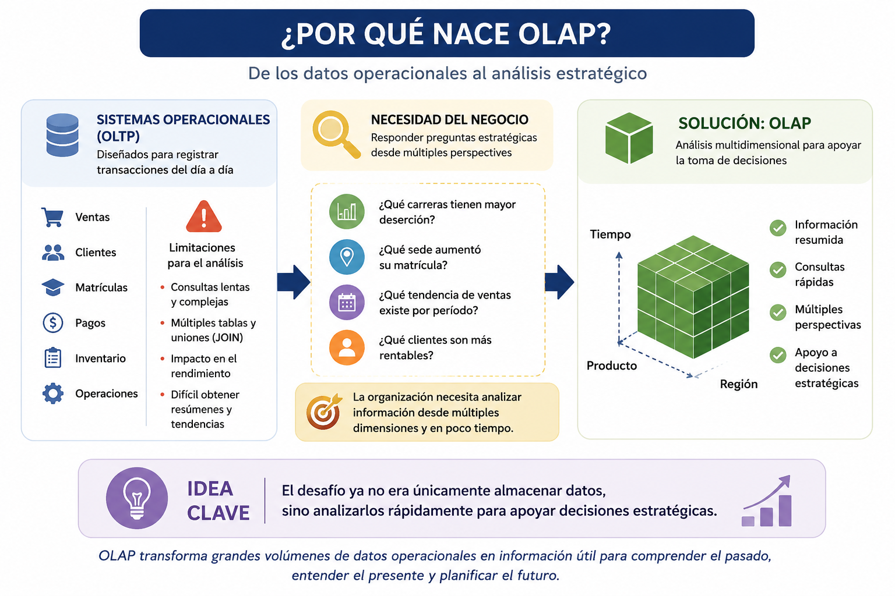
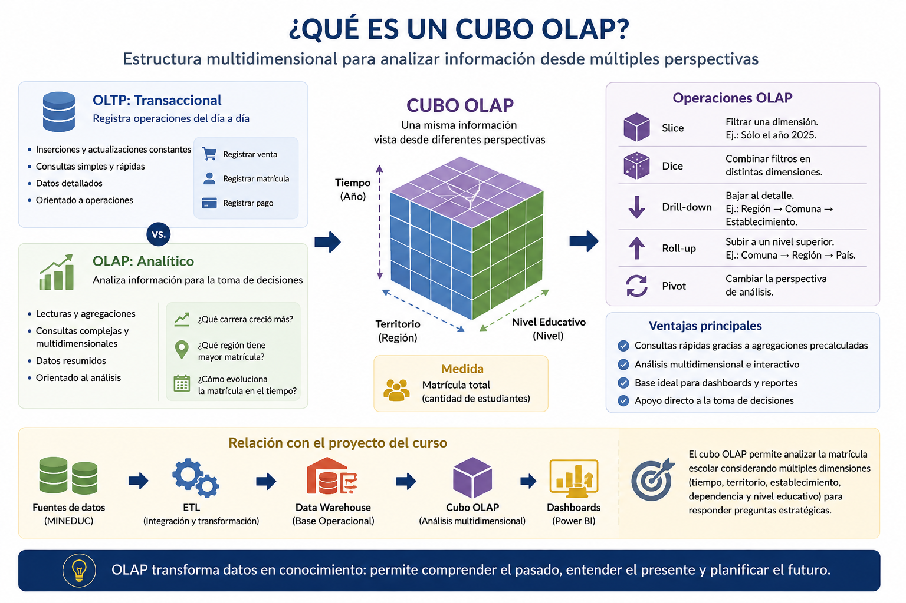
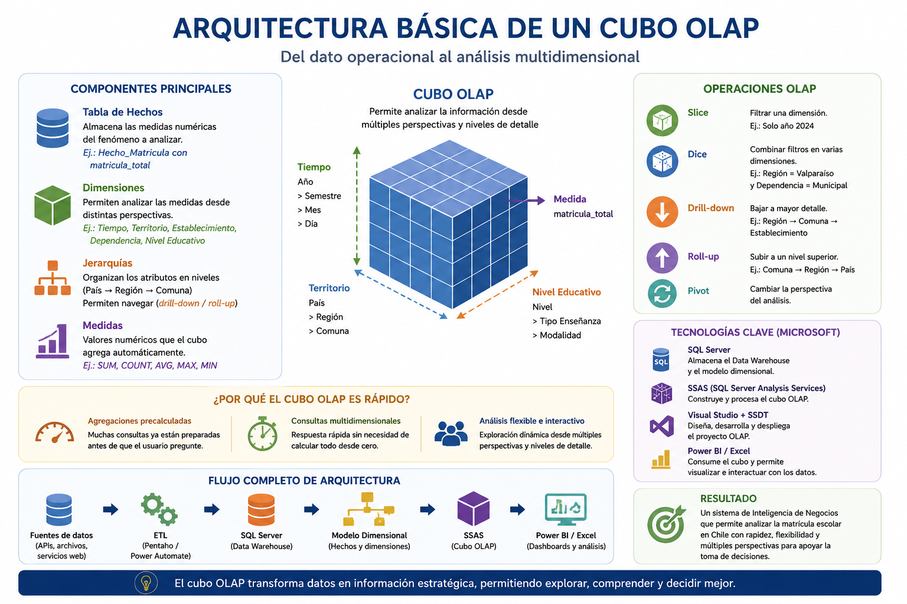
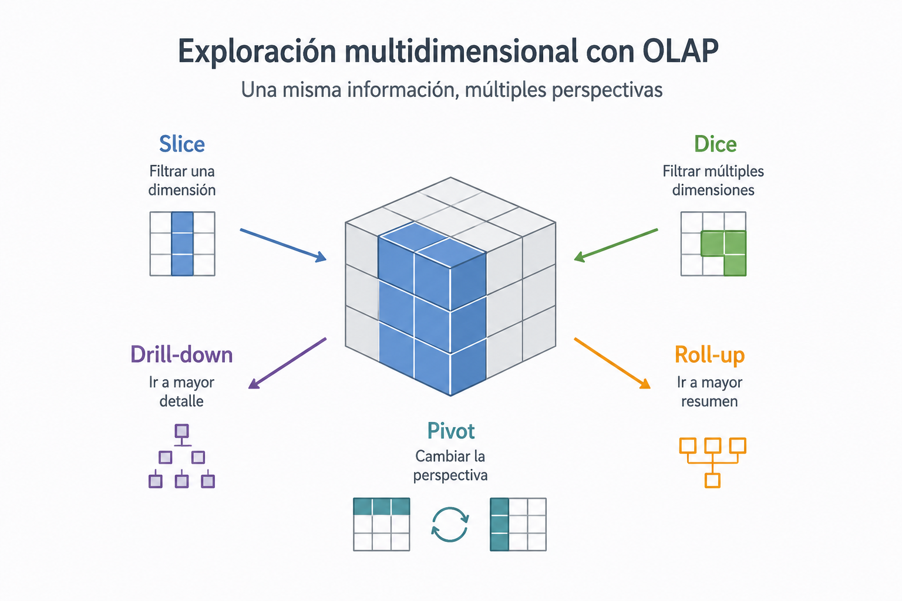
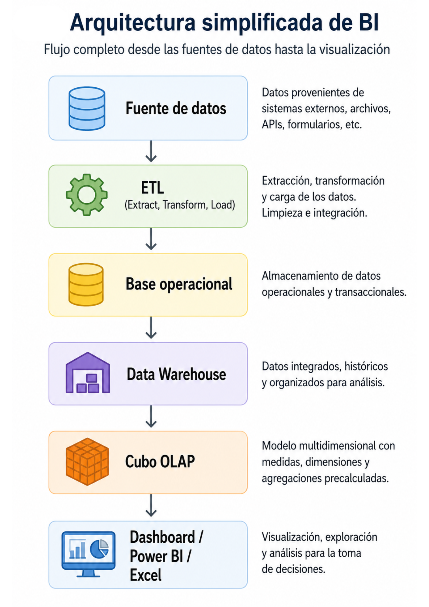

# Introducción a Cubos OLAP y análisis multidimensional

# 1. ¿Por qué nace OLAP?

Durante las últimas décadas, las organizaciones comenzaron a generar cantidades cada vez mayores de datos producto de sus operaciones diarias. Cada compra realizada en un supermercado, cada matrícula registrada en una universidad, cada pago efectuado en un banco o cada atención médica realizada en un hospital produce información que queda almacenada en sistemas computacionales. 

Inicialmente, estos sistemas fueron diseñados principalmente para apoyar las operaciones del día a día. Su objetivo era registrar transacciones de forma rápida, segura y consistente. Por esta razón, las bases de datos tradicionales se enfocaron en tareas como:

- registrar ventas;
- almacenar pagos;
- actualizar inventarios;
- gestionar clientes;
- controlar matrículas;
- procesar órdenes y transacciones.

Este tipo de sistemas recibe el nombre de **OLTP (Online Transaction Processing)**, y su principal preocupación es garantizar que las operaciones funcionen correctamente y con rapidez.

## 1.1 El problema del crecimiento de los datos

Con el paso del tiempo, las organizaciones comenzaron a enfrentar un nuevo problema: aunque disponían de grandes cantidades de información, extraer conocimiento útil desde esos datos no era sencillo.

Por ejemplo, una universidad puede almacenar información relacionada con:

- estudiantes;
- carreras;
- asignaturas;
- asistencia;
- pagos;
- rendimiento académico;
- deserción;
- titulaciones.

Después de varios años de funcionamiento, esto puede transformarse en millones de registros distribuidos en múltiples tablas y sistemas distintos.

En teoría, toda esa información podría ser consultada directamente desde la base de datos operacional. Sin embargo, en la práctica comienzan a aparecer dificultades importantes.

## 1.2 Limitaciones de los sistemas operacionales para el análisis

Las bases de datos transaccionales fueron diseñadas para registrar operaciones, no para realizar análisis estratégicos complejos. 

Esto significa que responder preguntas de negocio utilizando directamente los sistemas operacionales puede transformarse en un proceso lento y difícil.

Por ejemplo, imagine la siguiente consulta:

> ¿Qué carreras han aumentado su matrícula en los últimos cinco años, diferenciando por sede, género y vía de ingreso?

Responder esta pregunta puede requerir:

- múltiples tablas;
- numerosas uniones (JOIN);
- filtros complejos;
- grandes volúmenes de datos históricos.

A medida que aumenta la cantidad de información, las consultas se vuelven más lentas y complejas. Además, ejecutar análisis pesados directamente sobre sistemas operacionales puede afectar el rendimiento de las aplicaciones que utiliza la organización diariamente.

En otras palabras:

- los sistemas operacionales son excelentes para registrar transacciones;
- pero no necesariamente para analizar información histórica y multidimensional.

## 1.3 La necesidad de apoyar la toma de decisiones

Con el crecimiento de los datos, las organizaciones comenzaron a necesitar algo más que simples registros operacionales. 

La gerencia ya no solo quería saber qué estaba ocurriendo en el presente, sino también comprender patrones, tendencias y comportamientos a lo largo del tiempo.

Por ejemplo, una empresa de retail podría necesitar responder preguntas como:

- ¿Qué región presenta mayores ventas?
- ¿Qué productos generan más rentabilidad?
- ¿Qué canal de venta ha crecido más durante el último año?
- ¿Qué sucursales presentan bajo desempeño?

Del mismo modo, una universidad podría preguntarse:

- ¿Qué carreras presentan mayor deserción?
- ¿Qué vía de ingreso genera mejores resultados académicos?
- ¿Qué sedes aumentaron más su matrícula?
- ¿Qué factores se relacionan con el retraso en la titulación?

Este tipo de preguntas ya no corresponde simplemente a consultar registros individuales. Ahora se requiere analizar la información desde múltiples perspectivas.

## 1.4 El análisis multidimensional

Una misma información puede observarse de distintas maneras dependiendo del objetivo del análisis.

Por ejemplo, una venta podría analizarse según:

- el tiempo;
- el producto;
- la región;
- el vendedor;
- el cliente;
- el canal de venta.

De la misma forma, la matrícula universitaria podría estudiarse según:

- carrera;
- sede;
- año;
- género;
- tipo de establecimiento escolar;
- vía de ingreso.

A esta capacidad de observar la información desde distintos puntos de vista se le conoce como **análisis multidimensional**.

El problema es que los sistemas operacionales tradicionales no fueron diseñados específicamente para este tipo de análisis.

## 1.5 El surgimiento de OLAP

Frente a esta necesidad de analizar grandes volúmenes de información de forma rápida y desde múltiples perspectivas, comenzaron a desarrollarse tecnologías especializadas orientadas al análisis estratégico.

Una de las más importantes fue **OLAP (Online Analytical Processing)**.

El objetivo de OLAP es permitir que las organizaciones puedan:

- resumir información;
- analizar tendencias;
- explorar datos desde distintas dimensiones;
- responder consultas complejas rápidamente;
- apoyar procesos de toma de decisiones.

En lugar de enfocarse en registrar transacciones individuales, OLAP se orienta al análisis histórico y estratégico de la información.

De esta manera, las organizaciones comienzan a pasar desde una lógica centrada únicamente en almacenar datos hacia una lógica orientada a transformar esos datos en conocimiento útil para la toma de decisiones.

> **Idea clave de la sección**
> El problema principal no era únicamente almacenar información, sino lograr analizarla de manera eficiente para responder preguntas estratégicas del negocio.
> Las tecnologías OLAP surgen precisamente como respuesta a esa necesidad.




---

# 2. ¿Qué es un cubo OLAP?

Cuando una organización comienza a almacenar grandes volúmenes de información, rápidamente aparece una nueva necesidad: no basta con guardar datos; también es necesario analizarlos de manera eficiente para apoyar la toma de decisiones.

En este contexto surgen los sistemas OLAP (*Online Analytical Processing*), cuyo objetivo principal es facilitar el análisis multidimensional de los datos.

Un cubo OLAP permite explorar información desde múltiples perspectivas, realizar comparaciones, detectar tendencias y responder preguntas analíticas complejas en pocos segundos. Este enfoque es ampliamente utilizado en sistemas de Business Intelligence, dashboards ejecutivos y plataformas analíticas modernas.

## 2.1 Diferencia entre OLTP y OLAP

Antes de comprender qué es un cubo OLAP, es importante diferenciar dos tipos de sistemas que normalmente conviven dentro de una organización:

* sistemas transaccionales;
* sistemas analíticos.

Aunque ambos trabajan con datos, sus objetivos son completamente distintos.

| Característica         | OLTP                          | OLAP                             |
| ---------------------- | ----------------------------- | -------------------------------- |
| Nombre                 | Online Transaction Processing | Online Analytical Processing     |
| Objetivo               | Registrar operaciones         | Analizar información             |
| Tipo de uso            | Operacional                   | Estratégico                      |
| Ejemplos               | ventas, pagos, matrículas     | análisis, tendencias, dashboards |
| Tipo de consultas      | simples y rápidas             | complejas y agregadas            |
| Actualización de datos | constante                     | periódica                        |
| Usuarios típicos       | cajeros, administrativos      | analistas, directivos            |
## 2.2 ¿Qué es un cubo OLAP?

Un cubo OLAP es una estructura de datos diseñada para analizar información desde múltiples dimensiones de manera rápida y eficiente.

El término “cubo” proviene de la idea de observar los datos desde diferentes perspectivas simultáneamente.

Por ejemplo, una organización podría analizar:

* ventas por año;
* ventas por región;
* ventas por producto;
* ventas por vendedor.

Todas esas perspectivas pueden combinarse entre sí. Un cubo OLAP no necesariamente tiene forma física de cubo. El concepto representa una estructura multidimensional donde los datos pueden explorarse dinámicamente.

## 2.3 Dimensiones y medidas

Los cubos OLAP se construyen principalmente a partir de dos elementos:

* dimensiones;
* medidas.

Comprender esta diferencia es fundamental. Las dimensiones representan las perspectivas desde las cuales se analiza la información.  Permiten responder preguntas como:

* ¿cuándo?;
* ¿dónde?;
* ¿qué?;
* ¿quién?;
* ¿cómo?

**Ejemplos de dimensiones**

| Contexto     | Dimensiones posibles               |
| ------------ | ---------------------------------- |
| Universidad  | año, carrera, región               |
| Supermercado | producto, sucursal, fecha          |
| Hospital     | paciente, especialidad, médico     |
| Banco        | cliente, sucursal, tipo de crédito |
**Medidas**
Las medidas corresponden a los valores numéricos que se desean analizar. Normalmente son cantidades que pueden:

* sumarse;
* promediarse;
* contarse;
* compararse.

**Ejemplos de medidas**

| Contexto   | Medidas               |
| ---------- | --------------------- |
| Educación  | matrícula total       |
| Ventas     | monto vendido         |
| Salud      | cantidad de pacientes |
| Transporte | cantidad de viajes    |
## 2.4 Operaciones típicas en OLAP

Los sistemas OLAP permiten realizar operaciones analíticas de manera interactiva.
1. Slice
	Consiste en filtrar una dimensión específica.
	Ejemplo: analizar únicamente el año 2025.
2. Dice
	Consiste en combinar múltiples filtros.
	Ejemplo:
	* región = Valparaíso;
	* año = 2025;
	* dependencia = municipal.
3. Drill-down
	Permite bajar al detalle.
	Ejemplo:
	* pasar desde región → comuna → establecimiento.
4. Roll-up
	Permite resumir información.
	Ejemplo:
	* pasar desde comuna → región → país.
5. Pivot
	Consiste en cambiar la perspectiva de análisis.
	Ejemplo:
	* visualizar regiones en filas y años en columnas;
	* luego invertir la vista.

## 2.5 Ventajas de los cubos OLAP

Los cubos OLAP poseen múltiples ventajas para el análisis organizacional. Entre otras tenemos las siguientes:
* Consultas rápidas
	Muchas agregaciones son precalculadas y almacenadas por el motor OLAP para acelerar las consultas analíticas.
* Análisis multidimensional
	La información puede explorarse desde múltiples perspectivas simultáneamente.
* Integración con Business Intelligence
	Los cubos OLAP son ampliamente utilizados en herramientas como:
	* Power BI;
	* Tableau;
	* Excel;
	* SQL Server Analysis Services (SSAS).
* Apoyo a la toma de decisiones
	Permiten detectar:
	* tendencias;
	* patrones;
	* comportamientos anómalos;
	* variaciones temporales.
* Exploración interactiva
	El usuario puede navegar entre distintos niveles de detalle sin modificar manualmente consultas SQL complejas.

## 2.6 Limitaciones de los cubos OLAP

Aunque son herramientas muy poderosas, también presentan algunas limitaciones. Entre las que mas se destacan podemos citar las siguientes:

* Requieren procesamiento previo
	Antes de utilizar un cubo, normalmente es necesario:
	* limpiar datos;
	* transformar información;
	* construir procesos ETL;
	* diseñar el modelo dimensional.
* Mayor uso de almacenamiento
	Las agregaciones precalculadas pueden aumentar considerablemente el espacio utilizado.
* Dependencia del diseño dimensional
	Si las dimensiones o medidas están mal diseñadas:
	* el análisis será incorrecto;
	* el rendimiento disminuirá;
	* las consultas perderán sentido analítico.
* No son ideales para transacciones
	Los cubos OLAP no están diseñados para registrar operaciones en tiempo real. Su función principal es el análisis.

> Un cubo OLAP permite transformar grandes volúmenes de datos organizacionales en información analítica útil para apoyar decisiones.
> Mientras los sistemas OLTP se enfocan en registrar operaciones, los sistemas OLAP se enfocan en comprender patrones, tendencias y comportamientos mediante análisis multidimensional.



---
# 3. Arquitectura básica de un cubo OLAP

Hasta este punto del curso hemos trabajado principalmente en la captura, integración, transformación y visualización de datos. Sin embargo, en muchos entornos empresariales existe una capa adicional orientada específicamente al análisis multidimensional y al soporte de decisiones: los cubos OLAP.

Un cubo OLAP no reemplaza al Data Warehouse ni a los procesos ETL. Por el contrario, se construye sobre ellos. Su propósito principal es permitir consultas analíticas rápidas y flexibles sobre grandes volúmenes de información, facilitando el análisis desde múltiples perspectivas y distintos niveles de detalle.

En términos simples, un cubo OLAP organiza los datos de manera que sea posible responder preguntas como:

* ¿Qué región concentra mayor matrícula?
* ¿Cómo evolucionó la matrícula durante los últimos años?
* ¿Qué dependencia administrativa presenta mayor crecimiento?
* ¿Qué establecimiento tiene mayor matrícula promedio?

Todo esto puede responderse rápidamente porque el cubo almacena estructuras optimizadas para el análisis.

## 3.1 ¿Qué necesita un cubo OLAP para existir?

Un cubo OLAP no puede construirse directamente desde datos desordenados o desde archivos planos sin preparación previa. Antes de llegar a la etapa OLAP, normalmente existe una arquitectura completa de Inteligencia de Negocios.

Durante el curso, muchas de estas etapas ya fueron desarrolladas:

* integración de datos mediante ETL;
* captura de información desde APIs y servicios web;
* almacenamiento en SQL Server;
* diseño de modelos dimensionales;
* construcción de dashboards analíticos.

En otras palabras, el cubo OLAP aparece después del trabajo de integración y modelamiento realizado previamente.

## 3.2 Componentes principales de un cubo OLAP

Un cubo OLAP se construye utilizando varios componentes fundamentales. Aunque internamente el funcionamiento técnico puede ser complejo, conceptualmente existen cuatro elementos principales:

* tabla de hechos;
* dimensiones;
* jerarquías;
* medidas.

**a) Tabla de hechos**
La tabla de hechos representa el fenómeno principal que será analizado.
Generalmente contiene:
* claves hacia las dimensiones;
* medidas numéricas;
* gran volumen de registros.

La tabla de hechos responde preguntas relacionadas con cantidades, valores o métricas. Por ejemplo:
* total de estudiantes;
* total de ventas;
* cantidad de transacciones;
* promedio de asistencia.

**b) Dimensiones**
Las dimensiones permiten analizar las medidas desde distintos puntos de vista.
Por ejemplo, una misma matrícula puede analizarse según:
* año;
* región;
* comuna;
* establecimiento;
* dependencia;
* nivel educativo.

Las dimensiones contienen atributos descriptivos que facilitan el análisis y la navegación de los datos.

**c) Jerarquías**
Las jerarquías son uno de los conceptos más importantes dentro de OLAP.
Una jerarquía define niveles organizados de información. Por ejemplo:

```text
País → Región → Comuna
```

o también:

```text
Año → Mes → Día
```

Las jerarquías permiten navegar entre distintos niveles de detalle. Por ejemplo:

* observar información resumida por región;
* luego bajar al detalle por comuna;
* posteriormente llegar al establecimiento específico.

Este proceso se conoce como: $Drill-down$
El proceso inverso, donde se vuelve a niveles más resumidos, se denomina: $Roll-up$

> Las jerarquías son fundamentales porque permiten que el análisis multidimensional sea flexible y dinámico.

**d) Medidas**
Las medidas son los valores numéricos que el cubo puede calcular automáticamente. Por ejemplo:
* SUM;
* COUNT;
* AVG;
* MAX;
* MIN.

Una característica muy importante es que muchas de estas agregaciones son precalculadas por el motor OLAP.

## 3.3 ¿Por qué el cubo OLAP es rápido?

Una de las principales ventajas de OLAP es la velocidad de consulta. Cuando se trabaja únicamente con SQL tradicional, muchas consultas requieren calcular agregaciones en tiempo real. Por ejemplo: $SUM(), AVG(), COUNT(), GROUP BY$ sobre millones de registros.

En cambio, el cubo OLAP genera previamente muchas de esas agregaciones. Esto significa que el sistema ya tiene preparados distintos niveles de resumen antes de que el usuario realice la consulta.  Por esta razón, las consultas suelen ser mucho más rápidas.

| SQL tradicional                | Cubo OLAP                               |
| ------------------------------ | --------------------------------------- |
| Normalmente calcula al momento | Muchas agregaciones ya están preparadas |
| Orientado a transacciones      | Orientado a análisis                    |
| Mayor flexibilidad técnica     | Mayor velocidad analítica               |
| Consultas complejas más lentas | Consultas multidimensionales rápidas    |
## 3.4 Relación entre SQL Server, SSAS y Visual Studio

En el ecosistema Microsoft, la construcción de cubos OLAP normalmente involucra varias herramientas.
1. SQL Server
	SQL Server almacena:
	* las tablas;
	* el Data Warehouse;
	* el modelo dimensional;
	* la información procesada por ETL.
Es decir, SQL Server contiene los datos base sobre los cuales trabajará el cubo.

2. SSAS (SQL Server Analysis Services)
	SSAS es el componente especializado en análisis multidimensional. Su función principal es:
	* construir el cubo OLAP;
	* definir dimensiones;
	* crear jerarquías;
	* procesar agregaciones;
	* optimizar consultas analíticas.

> En términos simples: 
> 	SQL Server almacena los datos
> 	SSAS construye el cubo

3. Visual Studio + SSDT
	Visual Studio, utilizando SQL Server Data Tools (SSDT), permite diseñar el proyecto OLAP.
	Desde Visual Studio es posible:
	* crear dimensiones;
	* definir medidas;
	* construir jerarquías;
	* procesar el cubo;
	* desplegarlo en SSAS.
Visual Studio funciona como el entorno de desarrollo del cubo.

4. Power BI
	Finalmente, Power BI puede conectarse al cubo OLAP para construir dashboards y visualizaciones. En realidad *Power BI* consume el cubo, pero normalmente no lo crea. El cubo generalmente reside en *SSAS*



---
# 4. Limitaciones y desafíos de los cubos OLAP

Aunque los cubos OLAP son muy útiles, también presentan desafíos. Los mas relevantes se presentan a continuación:
1. Tiempo de procesamiento
	El procesamiento inicial del cubo puede tardar varios minutos o incluso horas dependiendo del volumen de datos.
2. Consumo de almacenamiento
	Las agregaciones y estructuras multidimensionales pueden ocupar bastante espacio.
3. Dependencia del modelo dimensional
	Si el modelo dimensional está mal diseñado:
	* el cubo tendrá problemas;
	* las consultas serán inconsistentes;
	* los indicadores serán incorrectos.
4. Calidad de datos
	Un cubo OLAP no corrige automáticamente errores de calidad. Si los datos operacionales son incorrectos: GIGO (Garbage In → Garbage Out)
	
---
# 5. Operaciones OLAP y exploración multidimensional

Una vez construido el modelo dimensional y definido el cubo OLAP, el siguiente paso consiste en comprender cómo se utiliza realmente esta estructura para apoyar el análisis y la toma de decisiones.

El verdadero valor de un cubo OLAP no se encuentra únicamente en almacenar información organizada, sino en permitir que los usuarios exploren los datos desde múltiples perspectivas, identificando patrones, tendencias, variaciones y relaciones que serían difíciles de detectar mediante consultas tradicionales.

En un sistema transaccional tradicional, las bases de datos están diseñadas principalmente para registrar operaciones del día a día, por ejemplo:

* matrículas;
* ventas;
* pagos;
* inventario;
* transacciones bancarias.

Sin embargo, cuando una organización necesita responder preguntas analíticas más complejas, como:

* ¿Qué región presenta mayor crecimiento?
* ¿Qué dependencia educativa concentra más matrícula?
* ¿Cómo ha evolucionado la información en los últimos años?
* ¿Qué establecimientos presentan cambios significativos?

el procesamiento analítico multidimensional se vuelve mucho más adecuado.

## 5.1 ¿Qué significa explorar un cubo OLAP?

Explorar un cubo OLAP significa analizar la información desde diferentes dimensiones o perspectivas. La principal ventaja de OLAP es precisamente esa flexibilidad analítica.

En este contexto, las plataformas OLAP incorporan un conjunto de operaciones clásicas que permiten navegar por los datos multidimensionales. Estas operaciones constituyen la base conceptual del análisis multidimensional. De las ya mencionadas en apartados anteriores (Slice, Dice, Drill-down, Roll-up y Pivot), ahora centrare,os nuestra mira en:

**Jerarquías multidimensionales**
Las jerarquías son fundamentales dentro de los cubos OLAP, ya que permiten organizar las dimensiones en distintos niveles de detalle. Gracias a estas jerarquías es posible realizar operaciones como Drill-down y Roll-up.

1. Jerarquía temporal
	Una dimensión de tiempo puede organizarse como: Año → Semestre → Mes
2. Jerarquía territorial
	En el proyecto del curso, la dimensión territorio podría organizarse como: Región → Provincia → Comuna
3. Jerarquía institucional
	Otra posible jerarquía sería: Dependencia → Establecimiento

Las jerarquías permiten que el usuario navegue naturalmente entre distintos niveles de análisis.


---
# 6. Cierre

Los cubos OLAP representan una evolución respecto de las consultas tradicionales sobre bases de datos.

Su principal objetivo no es reemplazar los sistemas operacionales, sino proporcionar una estructura optimizada para el análisis multidimensional y la toma de decisiones.

Gracias a operaciones como:

* Slice;
* Dice;
* Drill-down;
* Roll-up;
* Pivot;

los usuarios pueden explorar grandes volúmenes de información de manera mucho más intuitiva, rápida y flexible.

En contextos organizacionales reales, esta capacidad analítica resulta fundamental para transformar datos en conocimiento útil para la gestión.

> El cubo OLAP no reemplaza las bases de datos transaccionales, sino que organiza la información para facilitar el análisis y la toma de decisiones.


En la actualidad, muchas plataformas modernas de análisis y Business Intelligence incorporan conceptos derivados de OLAP, incluso cuando el usuario no interactúa directamente con cubos multidimensionales tradicionales. Comprender la lógica de dimensiones, medidas y jerarquías continúa siendo fundamental para diseñar sistemas analíticos eficientes y apoyar procesos de toma de decisiones basados en datos.